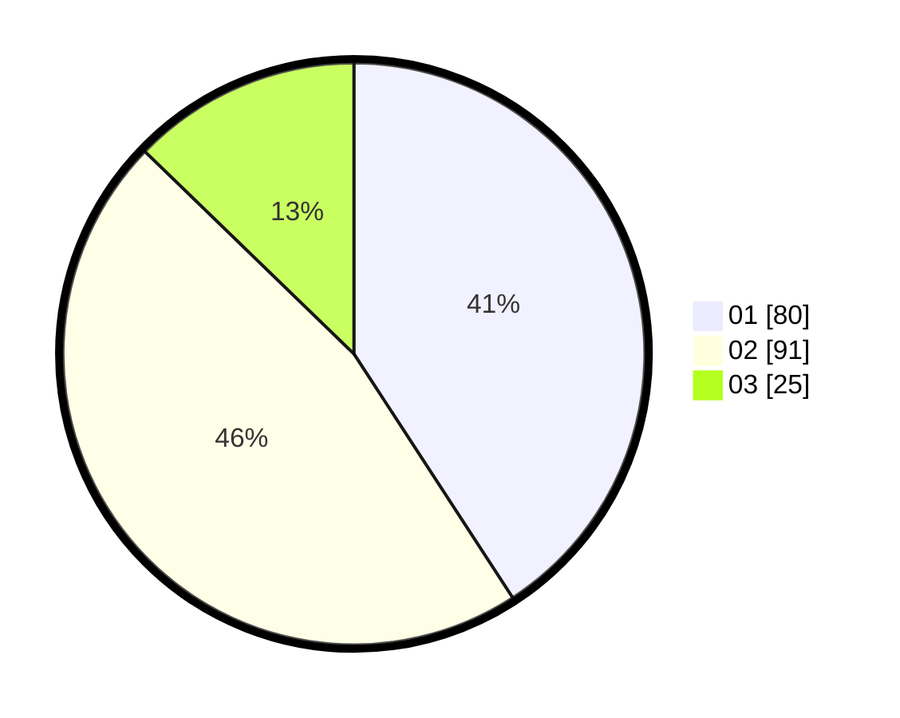

# Hasil

Hasil perolehan suara paslon dapat dilihat pada file paslon-01.txt, paslon-02.txt, dan paslon-03.txt.

Jika tidak ada, artinya data tersebut belum ada pada SIREKAP.

## Perolehan Suara

 * Paslon 01: **80**.
 * Paslon 02: **91**.
 * Paslon 03: **25**.

## Foto C Plano

https://sirekap-obj-formc.kpu.go.id/2910/pemilu/ppwp/31/73/06/10/04/3173061004023-20240216-144832--d07706e8-3baf-40a7-a2ea-9f9e1309c56f.jpg

https://sirekap-obj-formc.kpu.go.id/2910/pemilu/ppwp/31/73/06/10/04/3173061004023-20240216-144833--7752b7c0-927d-482a-9275-26d87bc49a3a.jpg

https://sirekap-obj-formc.kpu.go.id/2910/pemilu/ppwp/31/73/06/10/04/3173061004023-20240216-144832--bad0432f-1919-4b57-82ff-0c04bc60a202.jpg

## DATA PEMILIH TETAP

Jumlah pemilih dalam DPT: **261**.
 * L: **141**.
 * P: **120**.

## DATA PENGGUNA HAK PILIH

Jumlah pengguna hak pilih dalam DPT: **204**.
 * L: **105**.
 * P: **99**.

Jumlah pengguna hak pilih dalam DPTb: **0**.
 * L: **0**.
 * P: **0**.

Jumlah pengguna hak pilih dalam DPK: **0**.
 * L: **0**.
 * P: **0**.

Jumlah pengguna hak pilih: **204**.
 * L: **105**.
 * P: **99**.

## JUMLAH SUARA SAH DAN TIDAK SAH

JUMLAH SELURUH SUARA SAH: **200**.

JUMLAH SUARA TIDAK SAH: **4**.

JUMLAH SELURUH SUARA SAH DAN SUARA TIDAK SAH: **204**.
