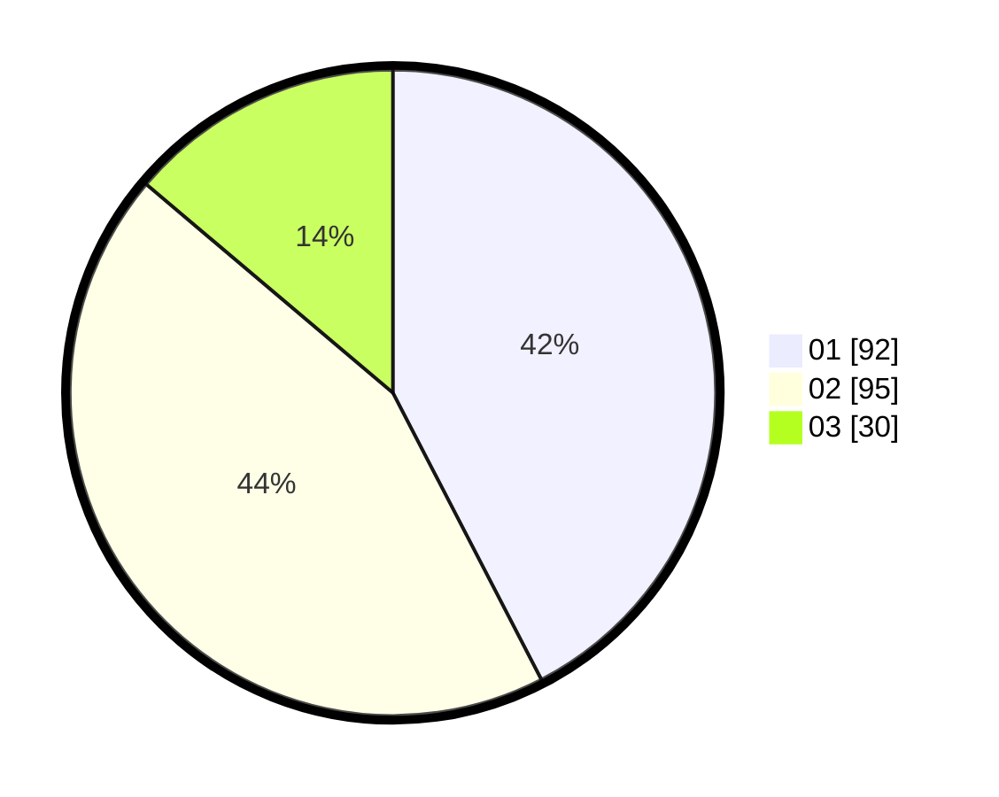

# Hasil

Hasil perolehan suara paslon dapat dilihat pada file paslon-01.txt, paslon-02.txt, dan paslon-03.txt.

Jika tidak ada, artinya data tersebut belum ada pada SIREKAP.

## Perolehan Suara

 * Paslon 01: **92**.
 * Paslon 02: **95**.
 * Paslon 03: **30**.

## Foto C Plano

https://sirekap-obj-formc.kpu.go.id/c201/pemilu/ppwp/31/73/06/10/04/3173061004024-20240214-190319--708b0f71-1e4d-4bc7-9869-61c24454512a.jpg

https://sirekap-obj-formc.kpu.go.id/c201/pemilu/ppwp/31/73/06/10/04/3173061004024-20240214-190056--b20eb8bb-45c9-4f66-9401-271fe1af8f6d.jpg

https://sirekap-obj-formc.kpu.go.id/c201/pemilu/ppwp/31/73/06/10/04/3173061004024-20240214-185925--a7447f2b-1a83-49da-bc00-09337e0f520d.jpg

## DATA PEMILIH TETAP

Jumlah pemilih dalam DPT: **274**.
 * L: **141**.
 * P: **133**.

## DATA PENGGUNA HAK PILIH

Jumlah pengguna hak pilih dalam DPT: **221**.
 * L: **110**.
 * P: **111**.

Jumlah pengguna hak pilih dalam DPTb: **0**.
 * L: **0**.
 * P: **0**.

Jumlah pengguna hak pilih dalam DPK: **0**.
 * L: **0**.
 * P: **0**.

Jumlah pengguna hak pilih: **221**.
 * L: **110**.
 * P: **111**.

## JUMLAH SUARA SAH DAN TIDAK SAH

JUMLAH SELURUH SUARA SAH: **217**.

JUMLAH SUARA TIDAK SAH: **4**.

JUMLAH SELURUH SUARA SAH DAN SUARA TIDAK SAH: **221**.
