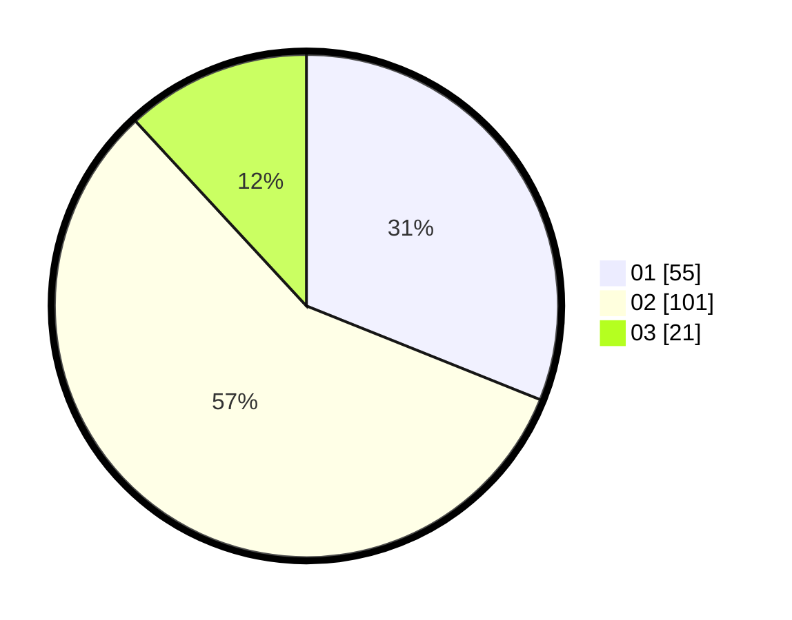

# Hasil

Hasil perolehan suara paslon dapat dilihat pada file paslon-01.txt, paslon-02.txt, dan paslon-03.txt.

Jika tidak ada, artinya data tersebut belum ada pada SIREKAP.

## Perolehan Suara

 * Paslon 01: **55**.
 * Paslon 02: **101**.
 * Paslon 03: **21**.

## Foto C Plano

https://sirekap-obj-formc.kpu.go.id/44bb/pemilu/ppwp/31/73/06/10/04/3173061004030-20240214-224643--c6ba7263-76f0-4e23-866f-4eca26ae43ea.jpg

https://sirekap-obj-formc.kpu.go.id/44bb/pemilu/ppwp/31/73/06/10/04/3173061004030-20240214-224652--011b409e-b4a9-461f-a670-33d87cae9da7.jpg

https://sirekap-obj-formc.kpu.go.id/44bb/pemilu/ppwp/31/73/06/10/04/3173061004030-20240214-224702--4a8d986d-7cd4-4001-911c-1191171c240d.jpg
