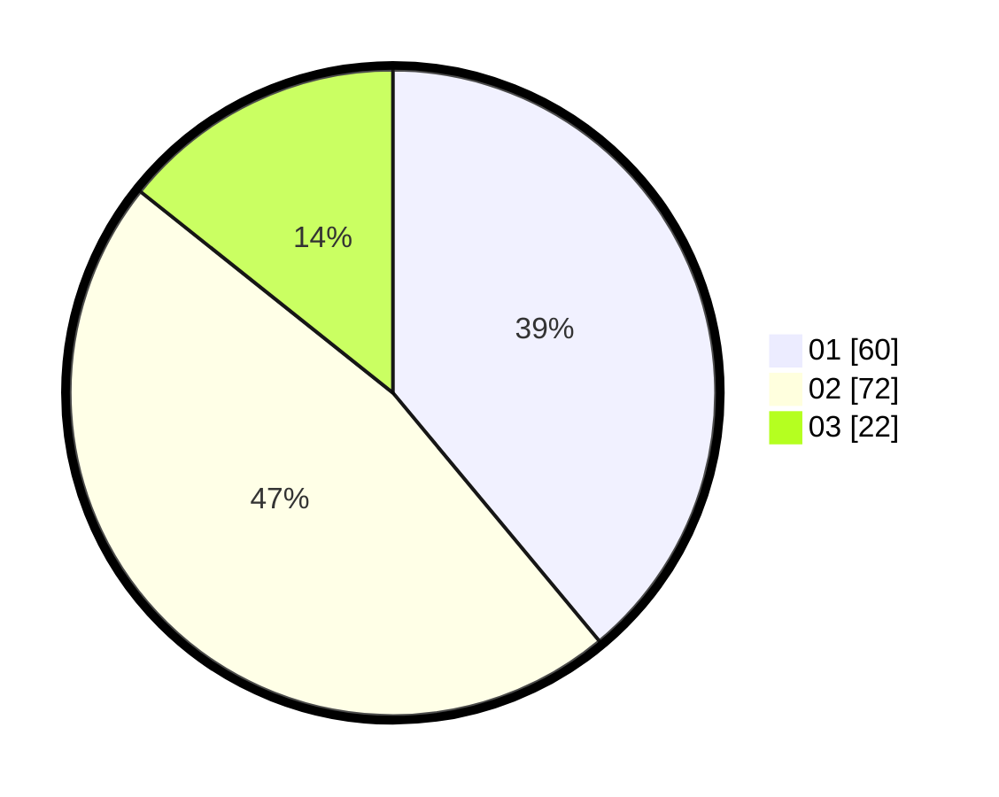

# Hasil

Hasil perolehan suara paslon dapat dilihat pada file paslon-01.txt, paslon-02.txt, dan paslon-03.txt.

Jika tidak ada, artinya data tersebut belum ada pada SIREKAP.

## Perolehan Suara

 * Paslon 01: **60**.
 * Paslon 02: **72**.
 * Paslon 03: **22**.

## Foto C Plano

https://sirekap-obj-formc.kpu.go.id/6f35/pemilu/ppwp/31/73/06/10/04/3173061004031-20240215-220500--2e20d3d7-2323-4d0a-8e42-6f2ef50c011e.jpg

https://sirekap-obj-formc.kpu.go.id/6f35/pemilu/ppwp/31/73/06/10/04/3173061004031-20240215-220503--a41f0a1a-61b8-4b51-beea-eb1b5625ddee.jpg

https://sirekap-obj-formc.kpu.go.id/6f35/pemilu/ppwp/31/73/06/10/04/3173061004031-20240215-220501--425ca9ca-91dc-42da-a507-24e336f5fdf7.jpg

## DATA PEMILIH TETAP

Jumlah pemilih dalam DPT: **273**.
 * L: **143**.
 * P: **130**.

## DATA PENGGUNA HAK PILIH

Jumlah pengguna hak pilih dalam DPT: **152**.
 * L: **78**.
 * P: **74**.

Jumlah pengguna hak pilih dalam DPTb: **0**.
 * L: **0**.
 * P: **0**.

Jumlah pengguna hak pilih dalam DPK: **4**.
 * L: **1**.
 * P: **3**.

Jumlah pengguna hak pilih: **156**.
 * L: **79**.
 * P: **77**.

## JUMLAH SUARA SAH DAN TIDAK SAH

JUMLAH SELURUH SUARA SAH: **154**.

JUMLAH SUARA TIDAK SAH: **2**.

JUMLAH SELURUH SUARA SAH DAN SUARA TIDAK SAH: **156**.
