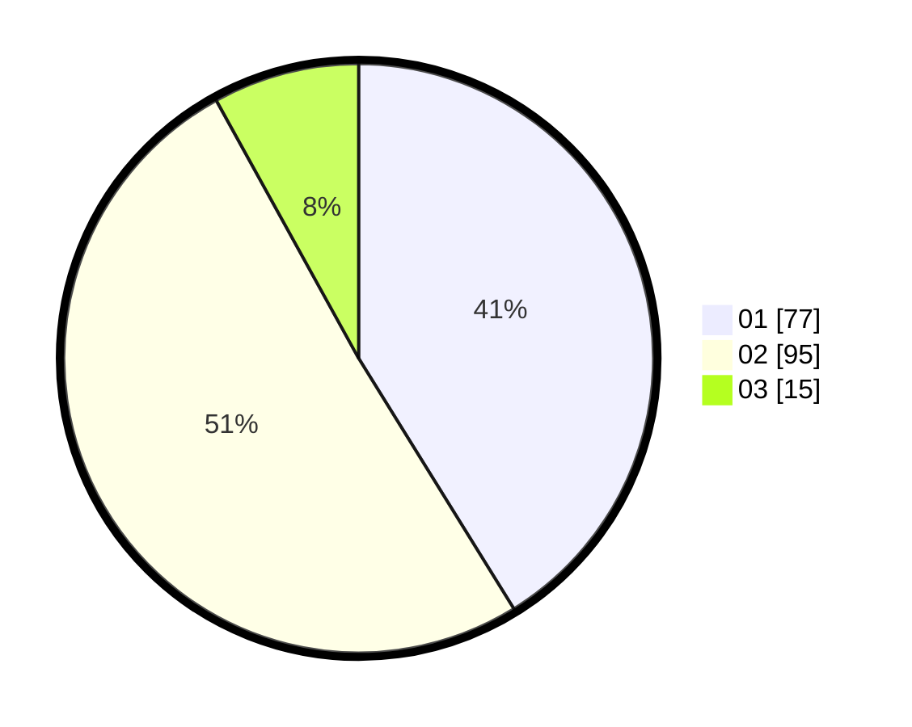

# Hasil

Hasil perolehan suara paslon dapat dilihat pada file paslon-01.txt, paslon-02.txt, dan paslon-03.txt.

Jika tidak ada, artinya data tersebut belum ada pada SIREKAP.

## Perolehan Suara

 * Paslon 01: **77**.
 * Paslon 02: **95**.
 * Paslon 03: **15**.

## Foto C Plano

https://sirekap-obj-formc.kpu.go.id/251d/pemilu/ppwp/31/73/06/10/04/3173061004032-20240215-004322--1dde4ada-205b-4900-b316-45c723ff9fad.jpg

https://sirekap-obj-formc.kpu.go.id/251d/pemilu/ppwp/31/73/06/10/04/3173061004032-20240215-004419--4a93c745-2016-4cc8-811f-1f5a306ecaba.jpg

https://sirekap-obj-formc.kpu.go.id/251d/pemilu/ppwp/31/73/06/10/04/3173061004032-20240215-021003--25d349de-b749-4374-b85f-476ae16beb1a.jpg
