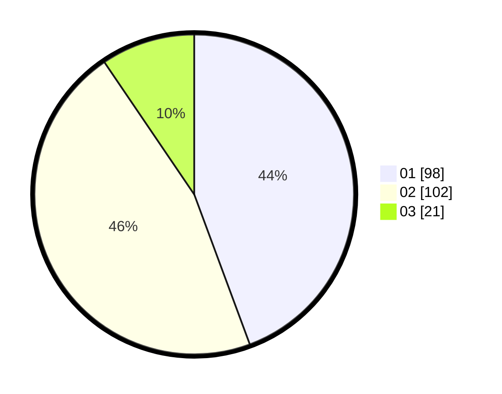

# Hasil

Hasil perolehan suara paslon dapat dilihat pada file paslon-01.txt, paslon-02.txt, dan paslon-03.txt.

Jika tidak ada, artinya data tersebut belum ada pada SIREKAP.

## Perolehan Suara

 * Paslon 01: **98**.
 * Paslon 02: **102**.
 * Paslon 03: **21**.

## Foto C Plano

https://sirekap-obj-formc.kpu.go.id/dd56/pemilu/ppwp/31/73/06/10/04/3173061004035-20240215-225849--34757e0b-2eaa-431c-a568-cfd1eb4d2d2b.jpg

https://sirekap-obj-formc.kpu.go.id/dd56/pemilu/ppwp/31/73/06/10/04/3173061004035-20240215-225854--940dffd8-270d-44e9-8838-9cd9715ef10a.jpg

https://sirekap-obj-formc.kpu.go.id/dd56/pemilu/ppwp/31/73/06/10/04/3173061004035-20240215-225852--0c7f37b8-ba37-4874-97c4-88e9257c8097.jpg

## DATA PEMILIH TETAP

Jumlah pemilih dalam DPT: **271**.
 * L: **136**.
 * P: **135**.

## DATA PENGGUNA HAK PILIH

Jumlah pengguna hak pilih dalam DPT: **222**.
 * L: **106**.
 * P: **116**.

Jumlah pengguna hak pilih dalam DPTb: **0**.
 * L: **0**.
 * P: **0**.

Jumlah pengguna hak pilih dalam DPK: **0**.
 * L: **0**.
 * P: **0**.

Jumlah pengguna hak pilih: **222**.
 * L: **106**.
 * P: **116**.

## JUMLAH SUARA SAH DAN TIDAK SAH

JUMLAH SELURUH SUARA SAH: **221**.

JUMLAH SUARA TIDAK SAH: **1**.

JUMLAH SELURUH SUARA SAH DAN SUARA TIDAK SAH: **222**.
