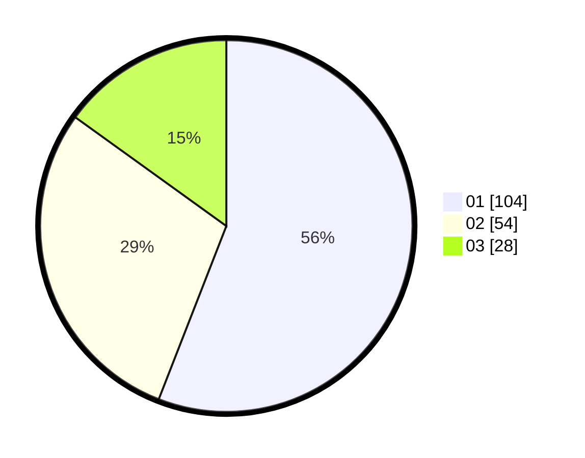

# Hasil

Hasil perolehan suara paslon dapat dilihat pada file paslon-01.txt, paslon-02.txt, dan paslon-03.txt.

Jika tidak ada, artinya data tersebut belum ada pada SIREKAP.

## Perolehan Suara

 * Paslon 01: **104**.
 * Paslon 02: **54**.
 * Paslon 03: **28**.

## Foto C Plano

https://sirekap-obj-formc.kpu.go.id/33cc/pemilu/ppwp/31/73/06/10/04/3173061004038-20240216-020017--152f008a-e8cb-48a3-a0eb-74c0e4ed9395.jpg

https://sirekap-obj-formc.kpu.go.id/33cc/pemilu/ppwp/31/73/06/10/04/3173061004038-20240216-014452--860bace7-1cea-47a7-a388-642387607452.jpg

https://sirekap-obj-formc.kpu.go.id/33cc/pemilu/ppwp/31/73/06/10/04/3173061004038-20240216-014446--b014bb3d-03a8-4087-a8ec-41b74b5252f4.jpg

## DATA PEMILIH TETAP

Jumlah pemilih dalam DPT: **245**.
 * L: **122**.
 * P: **123**.

## DATA PENGGUNA HAK PILIH

Jumlah pengguna hak pilih dalam DPT: **185**.
 * L: **89**.
 * P: **96**.

Jumlah pengguna hak pilih dalam DPTb: **0**.
 * L: **0**.
 * P: **0**.

Jumlah pengguna hak pilih dalam DPK: **3**.
 * L: **1**.
 * P: **2**.

Jumlah pengguna hak pilih: **188**.
 * L: **90**.
 * P: **98**.

## JUMLAH SUARA SAH DAN TIDAK SAH

JUMLAH SELURUH SUARA SAH: **186**.

JUMLAH SUARA TIDAK SAH: **2**.

JUMLAH SELURUH SUARA SAH DAN SUARA TIDAK SAH: **188**.
