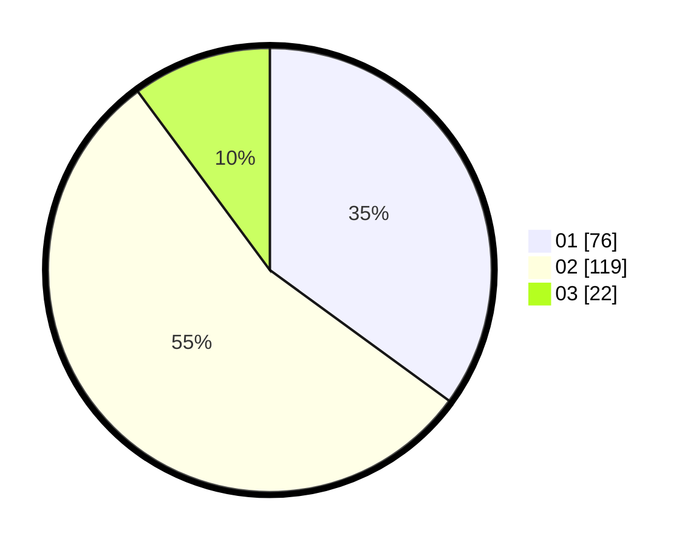

# Hasil

Hasil perolehan suara paslon dapat dilihat pada file paslon-01.txt, paslon-02.txt, dan paslon-03.txt.

Jika tidak ada, artinya data tersebut belum ada pada SIREKAP.

## Perolehan Suara

 * Paslon 01: **76**.
 * Paslon 02: **119**.
 * Paslon 03: **22**.

## Foto C Plano

https://sirekap-obj-formc.kpu.go.id/56ba/pemilu/ppwp/31/73/06/10/04/3173061004042-20240215-045318--086e322e-7f13-4068-9e62-30d2818e4850.jpg

https://sirekap-obj-formc.kpu.go.id/56ba/pemilu/ppwp/31/73/06/10/04/3173061004042-20240215-045339--a7f75f7f-d2be-4a6c-a030-d2c830b2c227.jpg

https://sirekap-obj-formc.kpu.go.id/56ba/pemilu/ppwp/31/73/06/10/04/3173061004042-20240215-045329--1ec8cc45-6a83-4450-b6bb-57579c0b8038.jpg

## DATA PEMILIH TETAP

Jumlah pemilih dalam DPT: **266**.
 * L: **135**.
 * P: **131**.

## DATA PENGGUNA HAK PILIH

Jumlah pengguna hak pilih dalam DPT: **215**.
 * L: **109**.
 * P: **106**.

Jumlah pengguna hak pilih dalam DPTb: **0**.
 * L: **0**.
 * P: **0**.

Jumlah pengguna hak pilih dalam DPK: **2**.
 * L: **1**.
 * P: **1**.

Jumlah pengguna hak pilih: **217**.
 * L: **110**.
 * P: **107**.

## JUMLAH SUARA SAH DAN TIDAK SAH

JUMLAH SELURUH SUARA SAH: **217**.

JUMLAH SUARA TIDAK SAH: **0**.

JUMLAH SELURUH SUARA SAH DAN SUARA TIDAK SAH: **217**.
