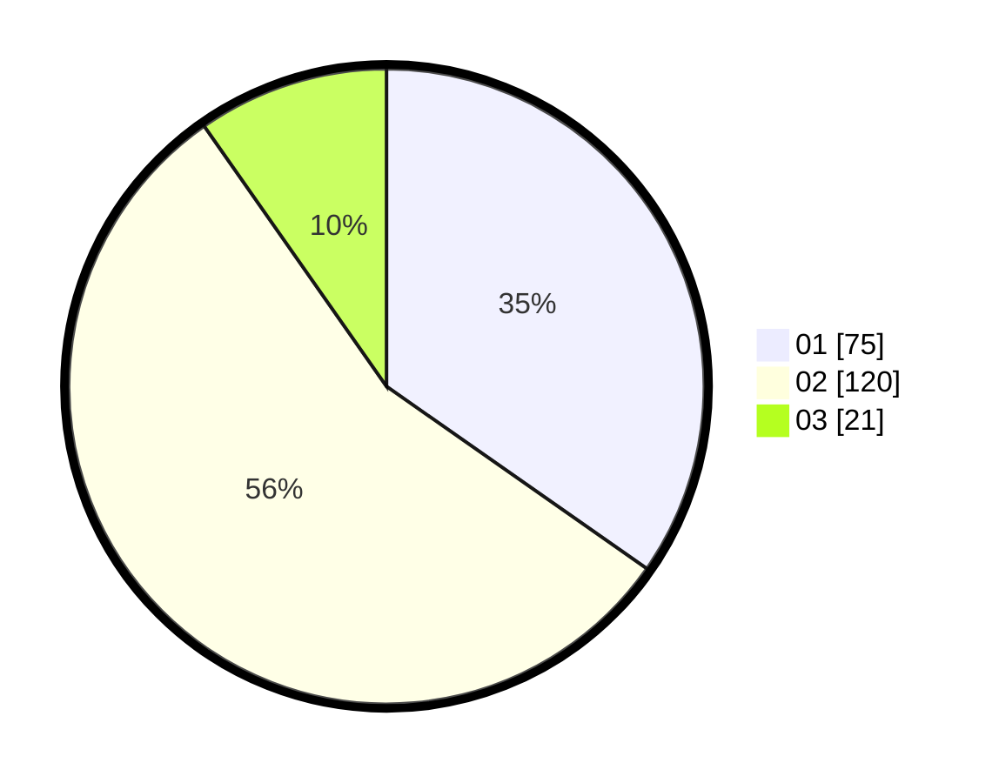

# Hasil

Hasil perolehan suara paslon dapat dilihat pada file paslon-01.txt, paslon-02.txt, dan paslon-03.txt.

Jika tidak ada, artinya data tersebut belum ada pada SIREKAP.

## Perolehan Suara

 * Paslon 01: **75**.
 * Paslon 02: **120**.
 * Paslon 03: **21**.

## Foto C Plano

https://sirekap-obj-formc.kpu.go.id/9602/pemilu/ppwp/31/73/06/10/04/3173061004043-20240216-015933--b42d2871-97d3-4941-99ab-ed73be19f891.jpg

https://sirekap-obj-formc.kpu.go.id/9602/pemilu/ppwp/31/73/06/10/04/3173061004043-20240216-015935--96cb3b57-7783-4666-96fb-9b0a9e77169b.jpg

https://sirekap-obj-formc.kpu.go.id/9602/pemilu/ppwp/31/73/06/10/04/3173061004043-20240216-015934--d888ff71-b378-4ab2-b0e4-46a06d24025b.jpg

## DATA PEMILIH TETAP

Jumlah pemilih dalam DPT: **273**.
 * L: **144**.
 * P: **129**.

## DATA PENGGUNA HAK PILIH

Jumlah pengguna hak pilih dalam DPT: **216**.
 * L: **108**.
 * P: **108**.

Jumlah pengguna hak pilih dalam DPTb: **0**.
 * L: **0**.
 * P: **0**.

Jumlah pengguna hak pilih dalam DPK: **0**.
 * L: **0**.
 * P: **0**.

Jumlah pengguna hak pilih: **216**.
 * L: **108**.
 * P: **108**.

## JUMLAH SUARA SAH DAN TIDAK SAH

JUMLAH SELURUH SUARA SAH: **216**.

JUMLAH SUARA TIDAK SAH: **0**.

JUMLAH SELURUH SUARA SAH DAN SUARA TIDAK SAH: **216**.
