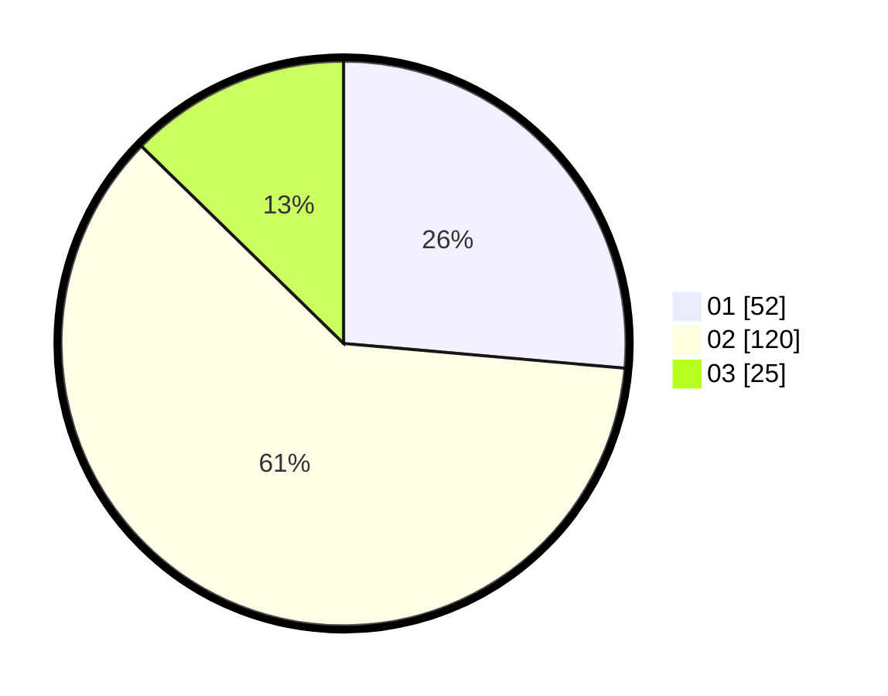

# Hasil

Hasil perolehan suara paslon dapat dilihat pada file paslon-01.txt, paslon-02.txt, dan paslon-03.txt.

Jika tidak ada, artinya data tersebut belum ada pada SIREKAP.

## Perolehan Suara

 * Paslon 01: **52**.
 * Paslon 02: **120**.
 * Paslon 03: **25**.

## Foto C Plano

https://sirekap-obj-formc.kpu.go.id/3ab7/pemilu/ppwp/31/73/06/10/04/3173061004048-20240214-190235--882bd581-df99-480d-9a95-ba12b4eb0305.jpg

https://sirekap-obj-formc.kpu.go.id/3ab7/pemilu/ppwp/31/73/06/10/04/3173061004048-20240214-190943--47e62016-de54-4fd4-a2e5-6fede0d11601.jpg

https://sirekap-obj-formc.kpu.go.id/3ab7/pemilu/ppwp/31/73/06/10/04/3173061004048-20240214-192601--f38b9775-0e12-4a37-ae7f-164535586fb9.jpg

## DATA PEMILIH TETAP

Jumlah pemilih dalam DPT: **201**.
 * L: **99**.
 * P: **102**.

## DATA PENGGUNA HAK PILIH

Jumlah pengguna hak pilih dalam DPT: **201**.
 * L: **99**.
 * P: **102**.

Jumlah pengguna hak pilih dalam DPTb: **0**.
 * L: **0**.
 * P: **0**.

Jumlah pengguna hak pilih dalam DPK: **4**.
 * L: **1**.
 * P: **3**.

Jumlah pengguna hak pilih: **205**.
 * L: **100**.
 * P: **105**.

## JUMLAH SUARA SAH DAN TIDAK SAH

JUMLAH SELURUH SUARA SAH: **197**.

JUMLAH SUARA TIDAK SAH: **8**.

JUMLAH SELURUH SUARA SAH DAN SUARA TIDAK SAH: **205**.
