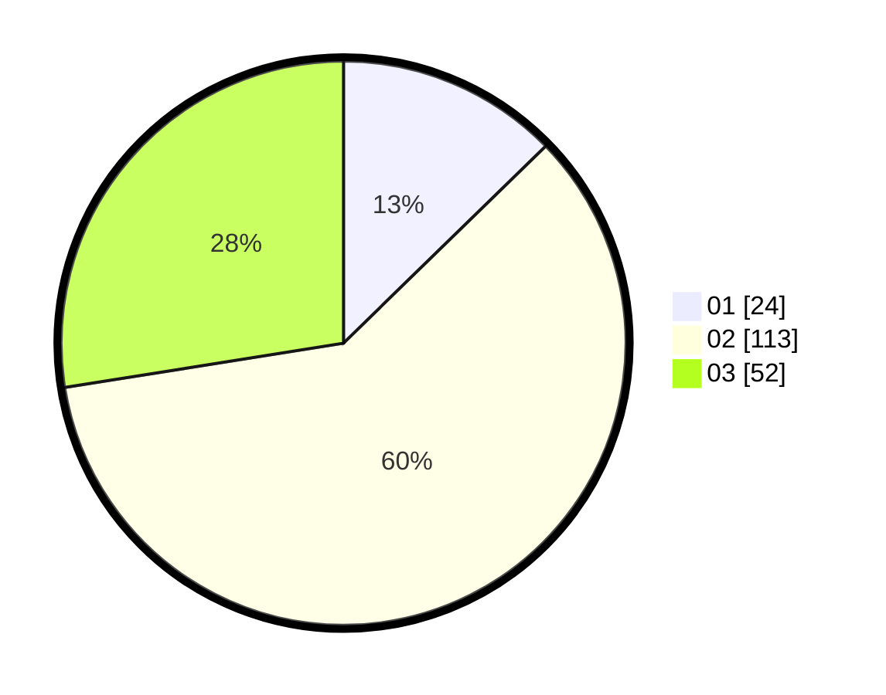

# Hasil

Hasil perolehan suara paslon dapat dilihat pada file paslon-01.txt, paslon-02.txt, dan paslon-03.txt.

Jika tidak ada, artinya data tersebut belum ada pada SIREKAP.

## Perolehan Suara

 * Paslon 01: **24**.
 * Paslon 02: **113**.
 * Paslon 03: **52**.

## Foto C Plano

https://sirekap-obj-formc.kpu.go.id/33ae/pemilu/ppwp/31/73/06/10/04/3173061004052-20240216-151259--5de6afbf-11a4-42df-b8b5-d0d20b213bd6.jpg

https://sirekap-obj-formc.kpu.go.id/33ae/pemilu/ppwp/31/73/06/10/04/3173061004052-20240216-151300--3b4cd012-096d-4454-8fb6-9acd1285ac95.jpg

https://sirekap-obj-formc.kpu.go.id/33ae/pemilu/ppwp/31/73/06/10/04/3173061004052-20240216-151300--bd3f4522-24d0-450e-80c4-d4aeb084cc00.jpg

## DATA PEMILIH TETAP

Jumlah pemilih dalam DPT: **272**.
 * L: **134**.
 * P: **138**.

## DATA PENGGUNA HAK PILIH

Jumlah pengguna hak pilih dalam DPT: **190**.
 * L: **91**.
 * P: **99**.

Jumlah pengguna hak pilih dalam DPTb: **0**.
 * L: **0**.
 * P: **0**.

Jumlah pengguna hak pilih dalam DPK: **1**.
 * L: **1**.
 * P: **0**.

Jumlah pengguna hak pilih: **191**.
 * L: **92**.
 * P: **99**.

## JUMLAH SUARA SAH DAN TIDAK SAH

JUMLAH SELURUH SUARA SAH: **189**.

JUMLAH SUARA TIDAK SAH: **2**.

JUMLAH SELURUH SUARA SAH DAN SUARA TIDAK SAH: **191**.
