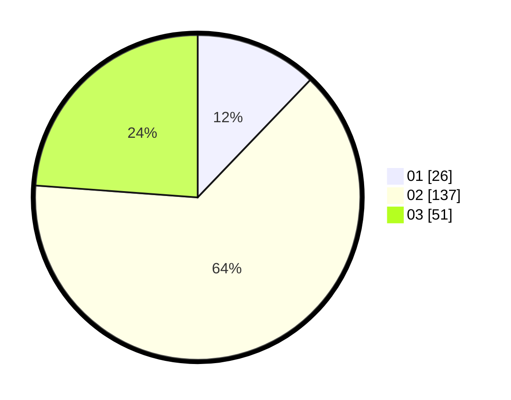

# Hasil

Hasil perolehan suara paslon dapat dilihat pada file paslon-01.txt, paslon-02.txt, dan paslon-03.txt.

Jika tidak ada, artinya data tersebut belum ada pada SIREKAP.

## Perolehan Suara

 * Paslon 01: **26**.
 * Paslon 02: **137**.
 * Paslon 03: **51**.

## Foto C Plano

https://sirekap-obj-formc.kpu.go.id/b6e5/pemilu/ppwp/31/73/06/10/04/3173061004053-20240216-012824--af3d7eb6-301f-43a2-811f-e6b6c3eabd15.jpg

https://sirekap-obj-formc.kpu.go.id/b6e5/pemilu/ppwp/31/73/06/10/04/3173061004053-20240216-012834--720bd42f-0081-498f-a08b-42dd9f6072f6.jpg

https://sirekap-obj-formc.kpu.go.id/b6e5/pemilu/ppwp/31/73/06/10/04/3173061004053-20240216-012826--53cf6077-60f6-437b-8ea1-e2c61e37abb4.jpg

## DATA PEMILIH TETAP

Jumlah pemilih dalam DPT: **217**.
 * L: **92**.
 * P: **125**.

## DATA PENGGUNA HAK PILIH

Jumlah pengguna hak pilih dalam DPT: **217**.
 * L: **92**.
 * P: **125**.

Jumlah pengguna hak pilih dalam DPTb: **0**.
 * L: **0**.
 * P: **0**.

Jumlah pengguna hak pilih dalam DPK: **1**.
 * L: **0**.
 * P: **1**.

Jumlah pengguna hak pilih: **218**.
 * L: **92**.
 * P: **126**.

## JUMLAH SUARA SAH DAN TIDAK SAH

JUMLAH SELURUH SUARA SAH: **214**.

JUMLAH SUARA TIDAK SAH: **4**.

JUMLAH SELURUH SUARA SAH DAN SUARA TIDAK SAH: **218**.
