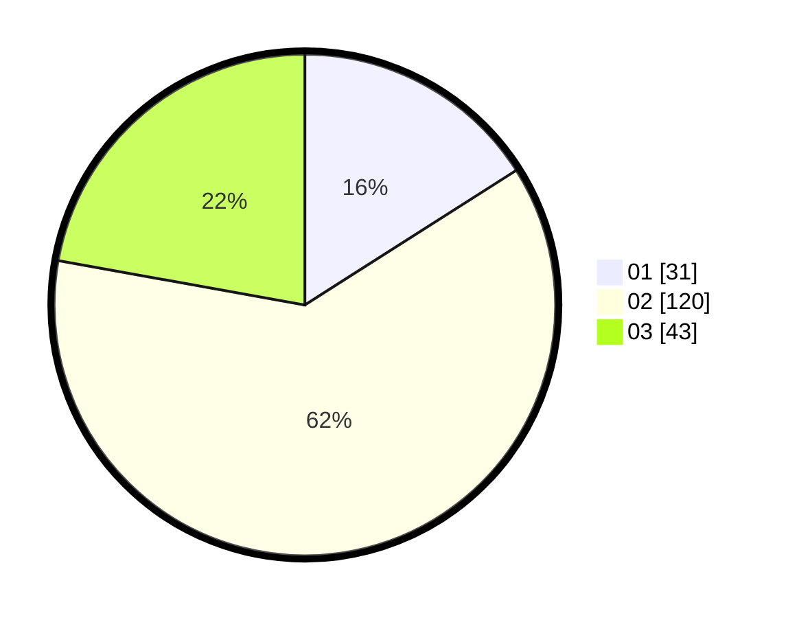

# Hasil

Hasil perolehan suara paslon dapat dilihat pada file paslon-01.txt, paslon-02.txt, dan paslon-03.txt.

Jika tidak ada, artinya data tersebut belum ada pada SIREKAP.

## Perolehan Suara

 * Paslon 01: **31**.
 * Paslon 02: **120**.
 * Paslon 03: **43**.

## Foto C Plano

https://sirekap-obj-formc.kpu.go.id/7bec/pemilu/ppwp/31/73/06/10/04/3173061004057-20240216-142755--4bd950c9-464f-4c60-a7d5-3adccb577220.jpg

https://sirekap-obj-formc.kpu.go.id/7bec/pemilu/ppwp/31/73/06/10/04/3173061004057-20240216-142756--235b3e5c-2142-41e6-a98a-4eb0c347577a.jpg

https://sirekap-obj-formc.kpu.go.id/7bec/pemilu/ppwp/31/73/06/10/04/3173061004057-20240216-142755--43092e30-0db0-41a2-9290-1f347e81f8c2.jpg

## DATA PEMILIH TETAP

Jumlah pemilih dalam DPT: **271**.
 * L: **131**.
 * P: **140**.

## DATA PENGGUNA HAK PILIH

Jumlah pengguna hak pilih dalam DPT: **196**.
 * L: **83**.
 * P: **113**.

Jumlah pengguna hak pilih dalam DPTb: **0**.
 * L: **0**.
 * P: **0**.

Jumlah pengguna hak pilih dalam DPK: **0**.
 * L: **0**.
 * P: **0**.

Jumlah pengguna hak pilih: **196**.
 * L: **83**.
 * P: **113**.

## JUMLAH SUARA SAH DAN TIDAK SAH

JUMLAH SELURUH SUARA SAH: **194**.

JUMLAH SUARA TIDAK SAH: **2**.

JUMLAH SELURUH SUARA SAH DAN SUARA TIDAK SAH: **196**.
