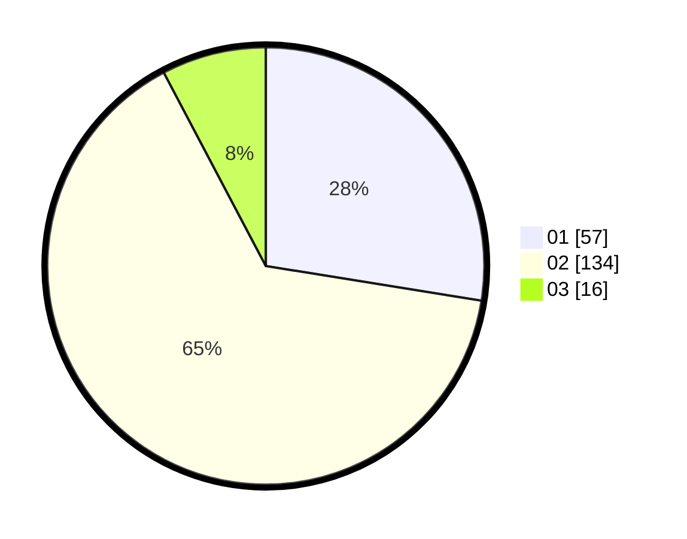

# Hasil

Hasil perolehan suara paslon dapat dilihat pada file paslon-01.txt, paslon-02.txt, dan paslon-03.txt.

Jika tidak ada, artinya data tersebut belum ada pada SIREKAP.

## Perolehan Suara

 * Paslon 01: **57**.
 * Paslon 02: **134**.
 * Paslon 03: **16**.

## Foto C Plano

https://sirekap-obj-formc.kpu.go.id/9373/pemilu/ppwp/31/73/06/10/04/3173061004058-20240216-031900--b3493462-ec3e-4be4-af6c-aa1571ccc248.jpg

https://sirekap-obj-formc.kpu.go.id/9373/pemilu/ppwp/31/73/06/10/04/3173061004058-20240216-031901--61185126-13c2-4782-996b-55f58d85ec47.jpg

https://sirekap-obj-formc.kpu.go.id/9373/pemilu/ppwp/31/73/06/10/04/3173061004058-20240216-031900--10fa10b3-eb50-4936-a09d-9c83f3a1f2cc.jpg

## DATA PEMILIH TETAP

Jumlah pemilih dalam DPT: **212**.
 * L: **106**.
 * P: **106**.

## DATA PENGGUNA HAK PILIH

Jumlah pengguna hak pilih dalam DPT: **212**.
 * L: **106**.
 * P: **106**.

Jumlah pengguna hak pilih dalam DPTb: **0**.
 * L: **0**.
 * P: **0**.

Jumlah pengguna hak pilih dalam DPK: **0**.
 * L: **0**.
 * P: **0**.

Jumlah pengguna hak pilih: **212**.
 * L: **106**.
 * P: **106**.

## JUMLAH SUARA SAH DAN TIDAK SAH

JUMLAH SELURUH SUARA SAH: **207**.

JUMLAH SUARA TIDAK SAH: **5**.

JUMLAH SELURUH SUARA SAH DAN SUARA TIDAK SAH: **212**.
