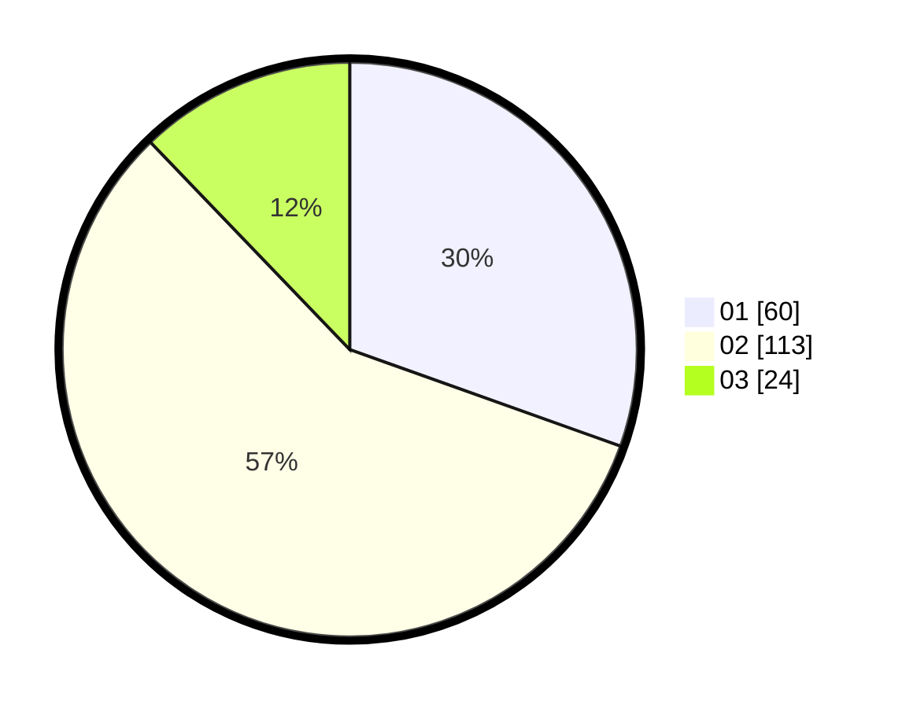

# Hasil

Hasil perolehan suara paslon dapat dilihat pada file paslon-01.txt, paslon-02.txt, dan paslon-03.txt.

Jika tidak ada, artinya data tersebut belum ada pada SIREKAP.

## Perolehan Suara

 * Paslon 01: **60**.
 * Paslon 02: **113**.
 * Paslon 03: **24**.

## Foto C Plano

https://sirekap-obj-formc.kpu.go.id/3e8a/pemilu/ppwp/31/73/06/10/04/3173061004059-20240215-210538--59fd74da-6588-453f-8dc3-cb0c01f8cc30.jpg

https://sirekap-obj-formc.kpu.go.id/3e8a/pemilu/ppwp/31/73/06/10/04/3173061004059-20240215-210540--291f1b64-ce35-4620-9ae5-1dd0fb16b89f.jpg

https://sirekap-obj-formc.kpu.go.id/3e8a/pemilu/ppwp/31/73/06/10/04/3173061004059-20240215-210539--f5991645-ce62-4a49-b52a-0540867eb236.jpg

## DATA PEMILIH TETAP

Jumlah pemilih dalam DPT: **267**.
 * L: **143**.
 * P: **124**.

## DATA PENGGUNA HAK PILIH

Jumlah pengguna hak pilih dalam DPT: **197**.
 * L: **96**.
 * P: **101**.

Jumlah pengguna hak pilih dalam DPTb: **0**.
 * L: **0**.
 * P: **0**.

Jumlah pengguna hak pilih dalam DPK: **7**.
 * L: **4**.
 * P: **3**.

Jumlah pengguna hak pilih: **204**.
 * L: **100**.
 * P: **104**.

## JUMLAH SUARA SAH DAN TIDAK SAH

JUMLAH SELURUH SUARA SAH: **197**.

JUMLAH SUARA TIDAK SAH: **7**.

JUMLAH SELURUH SUARA SAH DAN SUARA TIDAK SAH: **204**.
