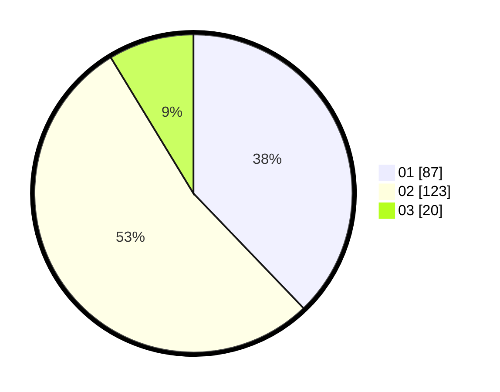

# Hasil

Hasil perolehan suara paslon dapat dilihat pada file paslon-01.txt, paslon-02.txt, dan paslon-03.txt.

Jika tidak ada, artinya data tersebut belum ada pada SIREKAP.

## Perolehan Suara

 * Paslon 01: **87**.
 * Paslon 02: **123**.
 * Paslon 03: **20**.

## Foto C Plano

https://sirekap-obj-formc.kpu.go.id/0045/pemilu/ppwp/31/73/06/10/04/3173061004063-20240214-155048--6f1b30d6-2195-44f9-af6f-9b63cb4b0075.jpg

https://sirekap-obj-formc.kpu.go.id/0045/pemilu/ppwp/31/73/06/10/04/3173061004063-20240214-155140--4fe41434-ee58-4c7f-9c50-6bae8a8d17a2.jpg

https://sirekap-obj-formc.kpu.go.id/0045/pemilu/ppwp/31/73/06/10/04/3173061004063-20240214-192140--2cbf6aa8-7a8e-4d84-ac5d-2b8e51d6373a.jpg

## DATA PEMILIH TETAP

Jumlah pemilih dalam DPT: **286**.
 * L: **148**.
 * P: **138**.

## DATA PENGGUNA HAK PILIH

Jumlah pengguna hak pilih dalam DPT: **232**.
 * L: **117**.
 * P: **115**.

Jumlah pengguna hak pilih dalam DPTb: **0**.
 * L: **0**.
 * P: **0**.

Jumlah pengguna hak pilih dalam DPK: **0**.
 * L: **0**.
 * P: **0**.

Jumlah pengguna hak pilih: **232**.
 * L: **117**.
 * P: **115**.

## JUMLAH SUARA SAH DAN TIDAK SAH

JUMLAH SELURUH SUARA SAH: **230**.

JUMLAH SUARA TIDAK SAH: **2**.

JUMLAH SELURUH SUARA SAH DAN SUARA TIDAK SAH: **232**.
