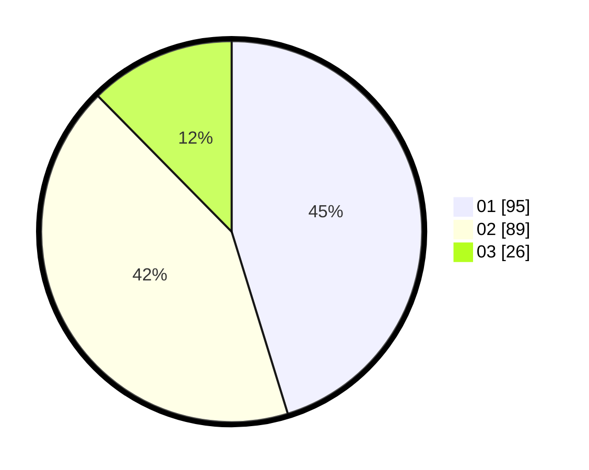

# Hasil

Hasil perolehan suara paslon dapat dilihat pada file paslon-01.txt, paslon-02.txt, dan paslon-03.txt.

Jika tidak ada, artinya data tersebut belum ada pada SIREKAP.

## Perolehan Suara

 * Paslon 01: **95**.
 * Paslon 02: **89**.
 * Paslon 03: **26**.

## Foto C Plano

https://sirekap-obj-formc.kpu.go.id/6287/pemilu/ppwp/31/73/06/10/04/3173061004071-20240216-041603--b2c24c35-5949-4d3f-af4d-a2808ef46356.jpg

https://sirekap-obj-formc.kpu.go.id/6287/pemilu/ppwp/31/73/06/10/04/3173061004071-20240216-041619--e6f2879b-446e-47ec-998a-30d15a9c97af.jpg

https://sirekap-obj-formc.kpu.go.id/6287/pemilu/ppwp/31/73/06/10/04/3173061004071-20240216-041614--fae3e408-1aec-44a3-b05b-c0ee17586629.jpg

## DATA PEMILIH TETAP

Jumlah pemilih dalam DPT: **249**.
 * L: **118**.
 * P: **131**.

## DATA PENGGUNA HAK PILIH

Jumlah pengguna hak pilih dalam DPT: **220**.
 * L: **100**.
 * P: **120**.

Jumlah pengguna hak pilih dalam DPTb: **0**.
 * L: **0**.
 * P: **0**.

Jumlah pengguna hak pilih dalam DPK: **0**.
 * L: **0**.
 * P: **0**.

Jumlah pengguna hak pilih: **220**.
 * L: **100**.
 * P: **120**.

## JUMLAH SUARA SAH DAN TIDAK SAH

JUMLAH SELURUH SUARA SAH: **210**.

JUMLAH SUARA TIDAK SAH: **10**.

JUMLAH SELURUH SUARA SAH DAN SUARA TIDAK SAH: **220**.
