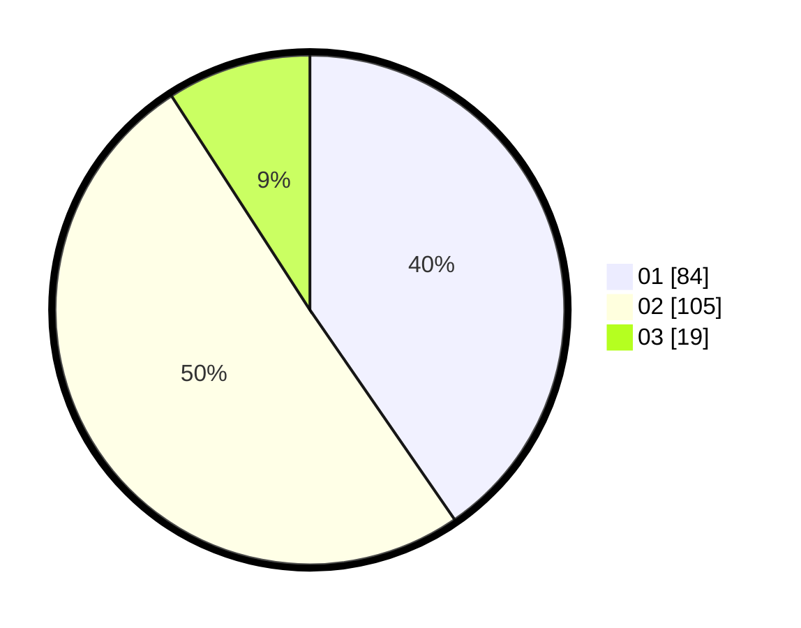

# Hasil

Hasil perolehan suara paslon dapat dilihat pada file paslon-01.txt, paslon-02.txt, dan paslon-03.txt.

Jika tidak ada, artinya data tersebut belum ada pada SIREKAP.

## Perolehan Suara

 * Paslon 01: **84**.
 * Paslon 02: **105**.
 * Paslon 03: **19**.

## Foto C Plano

https://sirekap-obj-formc.kpu.go.id/d5de/pemilu/ppwp/31/73/06/10/04/3173061004082-20240214-141717--1ca613eb-53ea-4089-9d50-5c575b19bca1.jpg

https://sirekap-obj-formc.kpu.go.id/d5de/pemilu/ppwp/31/73/06/10/04/3173061004082-20240214-141758--75650eec-2249-4f9f-8dc1-efaa4ab24d74.jpg

https://sirekap-obj-formc.kpu.go.id/d5de/pemilu/ppwp/31/73/06/10/04/3173061004082-20240214-141823--c97778e6-7198-474f-b15f-13f0ecdf44a0.jpg

## DATA PEMILIH TETAP

Jumlah pemilih dalam DPT: **298**.
 * L: **146**.
 * P: **152**.

## DATA PENGGUNA HAK PILIH

Jumlah pengguna hak pilih dalam DPT: **271**.
 * L: **124**.
 * P: **117**.

Jumlah pengguna hak pilih dalam DPTb: **0**.
 * L: **0**.
 * P: **0**.

Jumlah pengguna hak pilih dalam DPK: **0**.
 * L: **0**.
 * P: **0**.

Jumlah pengguna hak pilih: **0**.
 * L: **0**.
 * P: **0**.

## JUMLAH SUARA SAH DAN TIDAK SAH

JUMLAH SELURUH SUARA SAH: **208**.

JUMLAH SUARA TIDAK SAH: **17**.

JUMLAH SELURUH SUARA SAH DAN SUARA TIDAK SAH: **221**.
