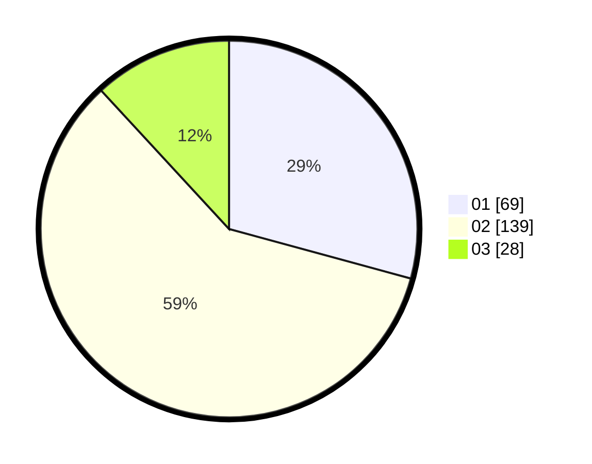

# Hasil

Hasil perolehan suara paslon dapat dilihat pada file paslon-01.txt, paslon-02.txt, dan paslon-03.txt.

Jika tidak ada, artinya data tersebut belum ada pada SIREKAP.

## Perolehan Suara

 * Paslon 01: **69**.
 * Paslon 02: **139**.
 * Paslon 03: **28**.

## Foto C Plano

https://sirekap-obj-formc.kpu.go.id/937c/pemilu/ppwp/31/73/06/10/04/3173061004083-20240214-235003--538aeef7-952a-473e-a280-d9169edb6306.jpg

https://sirekap-obj-formc.kpu.go.id/937c/pemilu/ppwp/31/73/06/10/04/3173061004083-20240214-235058--ce9a817b-c4fd-49b4-8899-248b15456d8e.jpg

https://sirekap-obj-formc.kpu.go.id/937c/pemilu/ppwp/31/73/06/10/04/3173061004083-20240214-235140--44be4c72-fbda-4b45-923d-b771f85cb1a5.jpg
