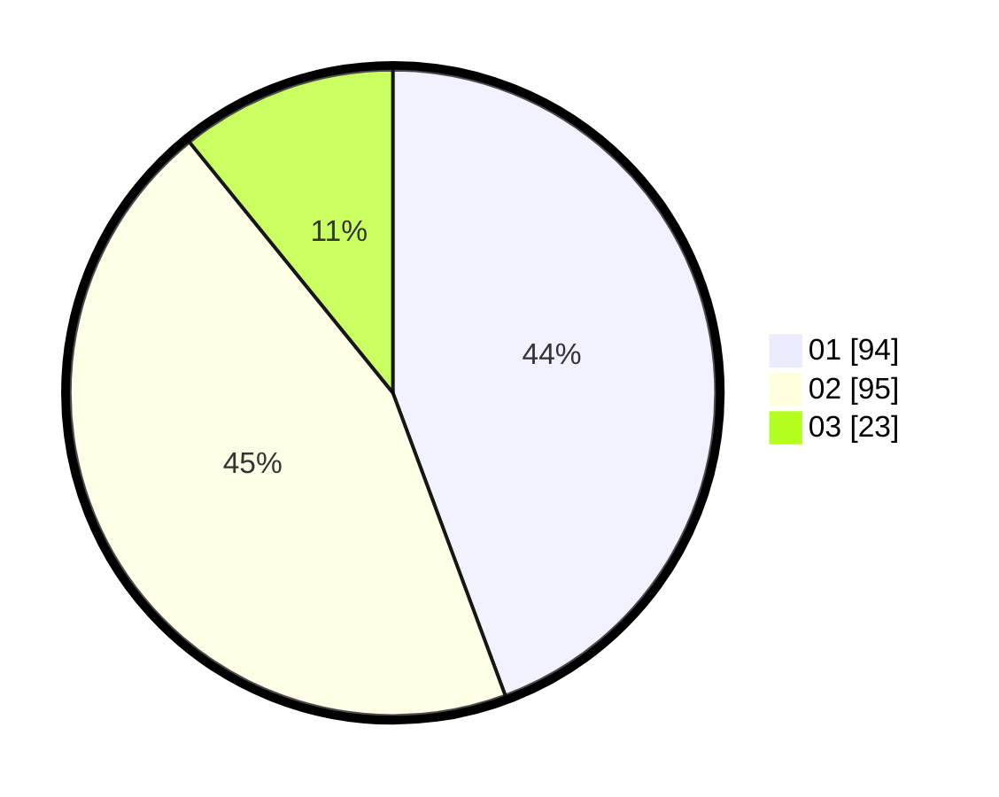

# Hasil

Hasil perolehan suara paslon dapat dilihat pada file paslon-01.txt, paslon-02.txt, dan paslon-03.txt.

Jika tidak ada, artinya data tersebut belum ada pada SIREKAP.

## Perolehan Suara

 * Paslon 01: **94**.
 * Paslon 02: **95**.
 * Paslon 03: **23**.

## Foto C Plano

https://sirekap-obj-formc.kpu.go.id/af16/pemilu/ppwp/31/73/06/10/04/3173061004090-20240215-012515--c927b385-8c42-4e11-a228-4a9a51d54f8e.jpg

https://sirekap-obj-formc.kpu.go.id/af16/pemilu/ppwp/31/73/06/10/04/3173061004090-20240215-012536--ed0b066d-5749-4eef-b7f3-60bd38b1b5a6.jpg

https://sirekap-obj-formc.kpu.go.id/af16/pemilu/ppwp/31/73/06/10/04/3173061004090-20240215-012525--d7ed0fd4-e638-4781-9f08-d1845cbf125b.jpg

## DATA PEMILIH TETAP

Jumlah pemilih dalam DPT: **279**.
 * L: **142**.
 * P: **137**.

## DATA PENGGUNA HAK PILIH

Jumlah pengguna hak pilih dalam DPT: **214**.
 * L: **104**.
 * P: **110**.

Jumlah pengguna hak pilih dalam DPTb: **0**.
 * L: **0**.
 * P: **0**.

Jumlah pengguna hak pilih dalam DPK: **0**.
 * L: **0**.
 * P: **0**.

Jumlah pengguna hak pilih: **214**.
 * L: **104**.
 * P: **110**.

## JUMLAH SUARA SAH DAN TIDAK SAH

JUMLAH SELURUH SUARA SAH: **212**.

JUMLAH SUARA TIDAK SAH: **2**.

JUMLAH SELURUH SUARA SAH DAN SUARA TIDAK SAH: **214**.
