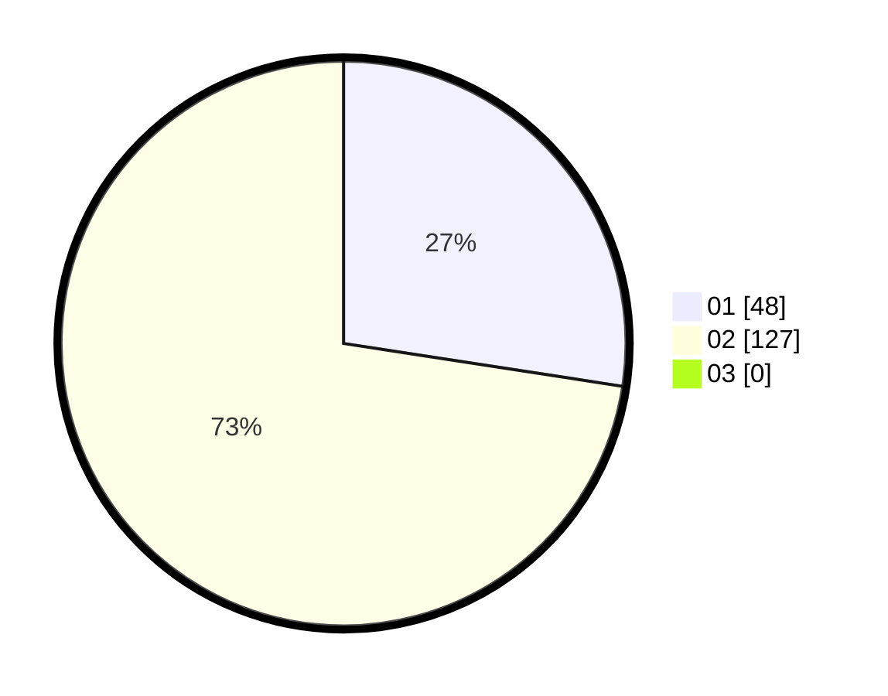

# Hasil

Hasil perolehan suara paslon dapat dilihat pada file paslon-01.txt, paslon-02.txt, dan paslon-03.txt.

Jika tidak ada, artinya data tersebut belum ada pada SIREKAP.

## Perolehan Suara

 * Paslon 01: **48**.
 * Paslon 02: **127**.
 * Paslon 03: **0**.

## Foto C Plano

https://sirekap-obj-formc.kpu.go.id/89c0/pemilu/ppwp/31/73/06/10/04/3173061004092-20240216-080939--b6f080f8-c81f-4db2-99ec-4ad5c204a6d0.jpg

https://sirekap-obj-formc.kpu.go.id/89c0/pemilu/ppwp/31/73/06/10/04/3173061004092-20240216-080941--aa46fd3e-3bdd-4ae3-892c-37f559ff8cd2.jpg

https://sirekap-obj-formc.kpu.go.id/89c0/pemilu/ppwp/31/73/06/10/04/3173061004092-20240216-080940--3f16ad70-7c44-470e-bab9-945fb18f183b.jpg

## DATA PEMILIH TETAP

Jumlah pemilih dalam DPT: **254**.
 * L: **127**.
 * P: **127**.

## DATA PENGGUNA HAK PILIH

Jumlah pengguna hak pilih dalam DPT: **216**.
 * L: **106**.
 * P: **110**.

Jumlah pengguna hak pilih dalam DPTb: **0**.
 * L: **0**.
 * P: **0**.

Jumlah pengguna hak pilih dalam DPK: **4**.
 * L: **1**.
 * P: **3**.

Jumlah pengguna hak pilih: **220**.
 * L: **107**.
 * P: **113**.

## JUMLAH SUARA SAH DAN TIDAK SAH

JUMLAH SELURUH SUARA SAH: **217**.

JUMLAH SUARA TIDAK SAH: **3**.

JUMLAH SELURUH SUARA SAH DAN SUARA TIDAK SAH: **220**.
