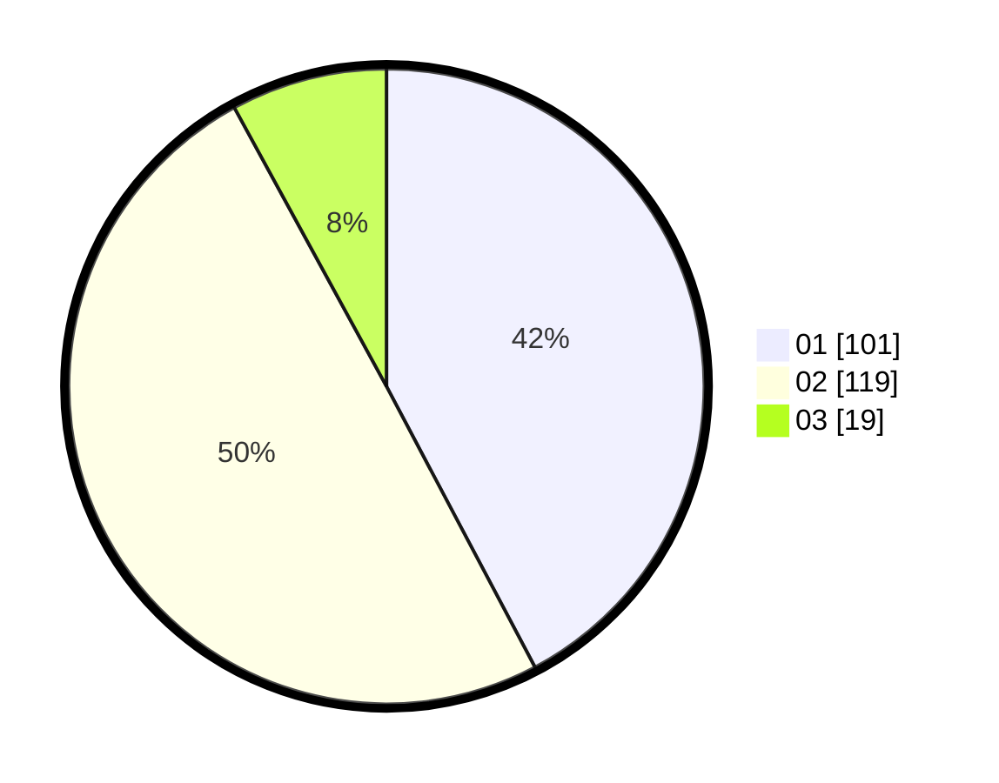

# Hasil

Hasil perolehan suara paslon dapat dilihat pada file paslon-01.txt, paslon-02.txt, dan paslon-03.txt.

Jika tidak ada, artinya data tersebut belum ada pada SIREKAP.

## Perolehan Suara

 * Paslon 01: **101**.
 * Paslon 02: **119**.
 * Paslon 03: **19**.

## Foto C Plano

https://sirekap-obj-formc.kpu.go.id/fc4b/pemilu/ppwp/31/73/06/10/04/3173061004093-20240216-121015--bd4537d4-c308-4920-94af-517a12ff30d3.jpg

https://sirekap-obj-formc.kpu.go.id/fc4b/pemilu/ppwp/31/73/06/10/04/3173061004093-20240216-163626--f7feac4b-aeb5-496b-8cfe-44e54188f70f.jpg

https://sirekap-obj-formc.kpu.go.id/fc4b/pemilu/ppwp/31/73/06/10/04/3173061004093-20240216-163626--e5e7a1fa-4c4c-4415-9dd2-f7b81a900058.jpg

## DATA PEMILIH TETAP

Jumlah pemilih dalam DPT: **269**.
 * L: **131**.
 * P: **138**.

## DATA PENGGUNA HAK PILIH

Jumlah pengguna hak pilih dalam DPT: **240**.
 * L: **117**.
 * P: **123**.

Jumlah pengguna hak pilih dalam DPTb: **2**.
 * L: **1**.
 * P: **1**.

Jumlah pengguna hak pilih dalam DPK: **0**.
 * L: **0**.
 * P: **0**.

Jumlah pengguna hak pilih: **242**.
 * L: **118**.
 * P: **124**.

## JUMLAH SUARA SAH DAN TIDAK SAH

JUMLAH SELURUH SUARA SAH: **239**.

JUMLAH SUARA TIDAK SAH: **3**.

JUMLAH SELURUH SUARA SAH DAN SUARA TIDAK SAH: **242**.
