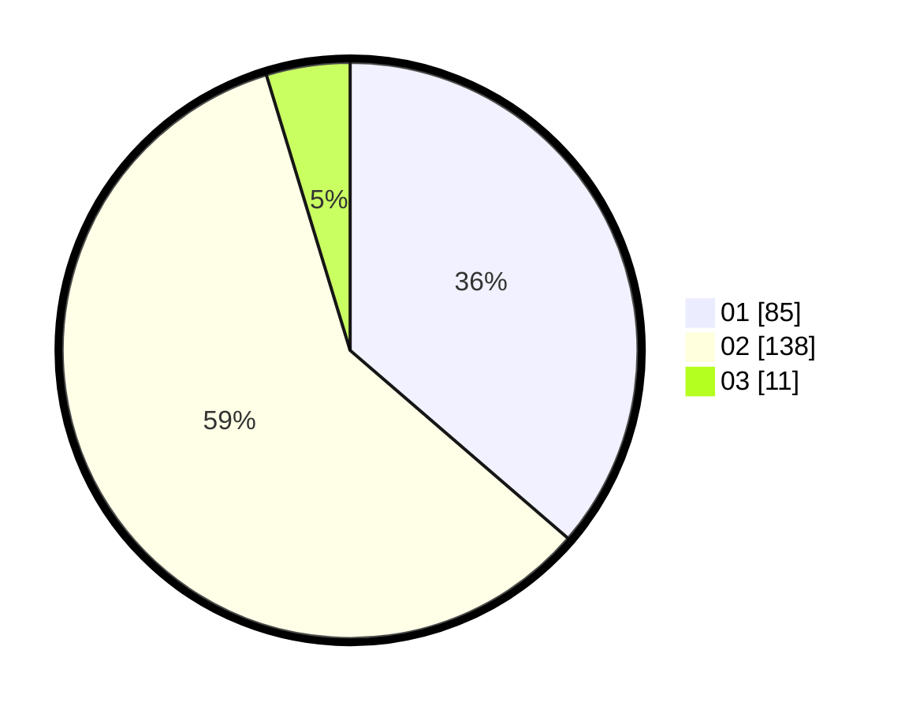

# Hasil

Hasil perolehan suara paslon dapat dilihat pada file paslon-01.txt, paslon-02.txt, dan paslon-03.txt.

Jika tidak ada, artinya data tersebut belum ada pada SIREKAP.

## Perolehan Suara

 * Paslon 01: **85**.
 * Paslon 02: **138**.
 * Paslon 03: **11**.

## Foto C Plano

https://sirekap-obj-formc.kpu.go.id/db1b/pemilu/ppwp/31/73/06/10/04/3173061004098-20240215-002016--f280a5f6-4bdb-4ec5-8290-df9561f82352.jpg

https://sirekap-obj-formc.kpu.go.id/db1b/pemilu/ppwp/31/73/06/10/04/3173061004098-20240215-002123--7a39c050-8c1b-43bd-ace6-441dbce7af94.jpg

https://sirekap-obj-formc.kpu.go.id/db1b/pemilu/ppwp/31/73/06/10/04/3173061004098-20240215-002211--8633f99a-8c19-4443-9bb3-7bd0cb3e671f.jpg
