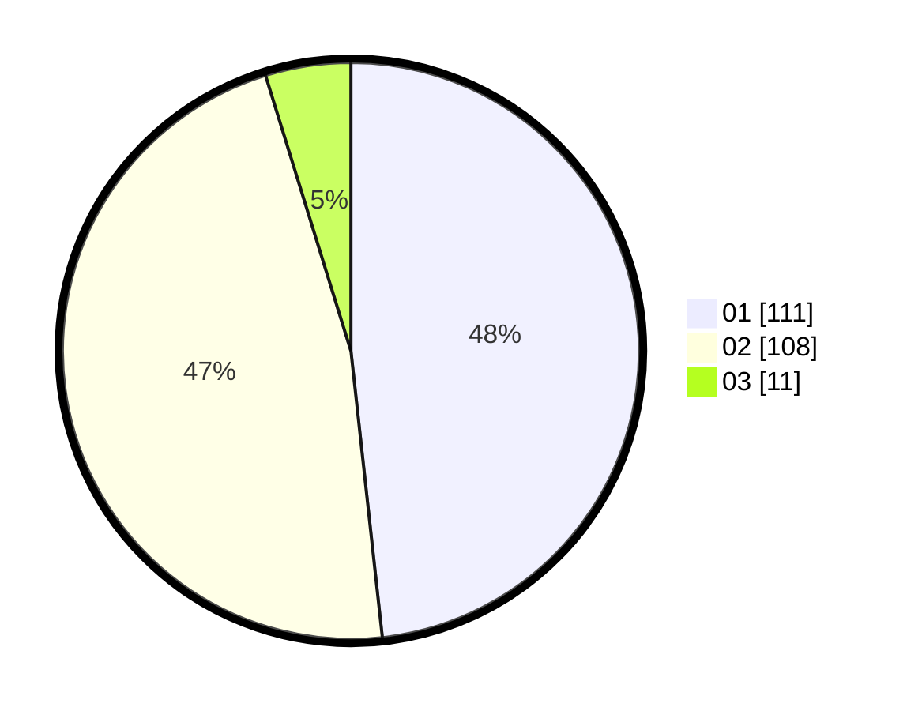

# Hasil

Hasil perolehan suara paslon dapat dilihat pada file paslon-01.txt, paslon-02.txt, dan paslon-03.txt.

Jika tidak ada, artinya data tersebut belum ada pada SIREKAP.

## Perolehan Suara

 * Paslon 01: **111**.
 * Paslon 02: **108**.
 * Paslon 03: **11**.

## Foto C Plano

https://sirekap-obj-formc.kpu.go.id/ee94/pemilu/ppwp/31/73/06/10/04/3173061004101-20240216-135418--eb2e6fc3-a47a-4588-a4f7-fb3457f52bf1.jpg

https://sirekap-obj-formc.kpu.go.id/ee94/pemilu/ppwp/31/73/06/10/04/3173061004101-20240216-135420--f9cdcea6-ed90-4156-864c-88662a7fcfb3.jpg

https://sirekap-obj-formc.kpu.go.id/ee94/pemilu/ppwp/31/73/06/10/04/3173061004101-20240216-135419--a40f232d-031a-44a8-8226-e88c6287ea03.jpg

## DATA PEMILIH TETAP

Jumlah pemilih dalam DPT: **275**.
 * L: **140**.
 * P: **135**.

## DATA PENGGUNA HAK PILIH

Jumlah pengguna hak pilih dalam DPT: **231**.
 * L: **113**.
 * P: **118**.

Jumlah pengguna hak pilih dalam DPTb: **3**.
 * L: **2**.
 * P: **1**.

Jumlah pengguna hak pilih dalam DPK: **1**.
 * L: **1**.
 * P: **0**.

Jumlah pengguna hak pilih: **235**.
 * L: **116**.
 * P: **119**.

## JUMLAH SUARA SAH DAN TIDAK SAH

JUMLAH SELURUH SUARA SAH: **230**.

JUMLAH SUARA TIDAK SAH: **5**.

JUMLAH SELURUH SUARA SAH DAN SUARA TIDAK SAH: **235**.
