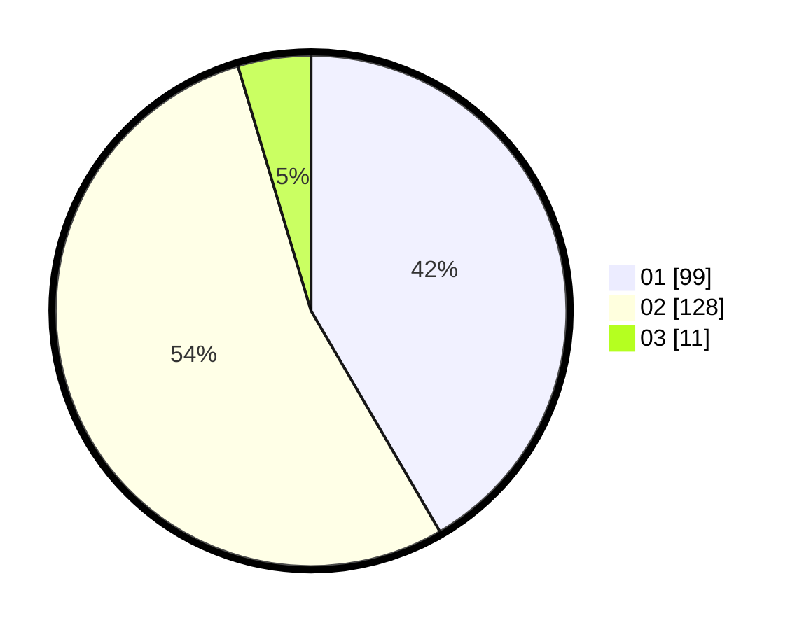

# Hasil

Hasil perolehan suara paslon dapat dilihat pada file paslon-01.txt, paslon-02.txt, dan paslon-03.txt.

Jika tidak ada, artinya data tersebut belum ada pada SIREKAP.

## Perolehan Suara

 * Paslon 01: **99**.
 * Paslon 02: **128**.
 * Paslon 03: **11**.

## Foto C Plano

https://sirekap-obj-formc.kpu.go.id/5b62/pemilu/ppwp/31/73/06/10/04/3173061004102-20240214-200141--2e319869-ca3f-48f3-93d0-02f3e07708fb.jpg

https://sirekap-obj-formc.kpu.go.id/5b62/pemilu/ppwp/31/73/06/10/04/3173061004102-20240214-212842--5b34b750-d491-4203-9dae-4c9a66bca50f.jpg

https://sirekap-obj-formc.kpu.go.id/5b62/pemilu/ppwp/31/73/06/10/04/3173061004102-20240216-130112--e8f7546d-2be0-4bdb-86cc-8dbebad585f6.jpg

## DATA PEMILIH TETAP

Jumlah pemilih dalam DPT: **295**.
 * L: **143**.
 * P: **152**.

## DATA PENGGUNA HAK PILIH

Jumlah pengguna hak pilih dalam DPT: **238**.
 * L: **117**.
 * P: **121**.

Jumlah pengguna hak pilih dalam DPTb: **1**.
 * L: **0**.
 * P: **1**.

Jumlah pengguna hak pilih dalam DPK: **3**.
 * L: **1**.
 * P: **2**.

Jumlah pengguna hak pilih: **242**.
 * L: **118**.
 * P: **124**.

## JUMLAH SUARA SAH DAN TIDAK SAH

JUMLAH SELURUH SUARA SAH: **238**.

JUMLAH SUARA TIDAK SAH: **4**.

JUMLAH SELURUH SUARA SAH DAN SUARA TIDAK SAH: **242**.
