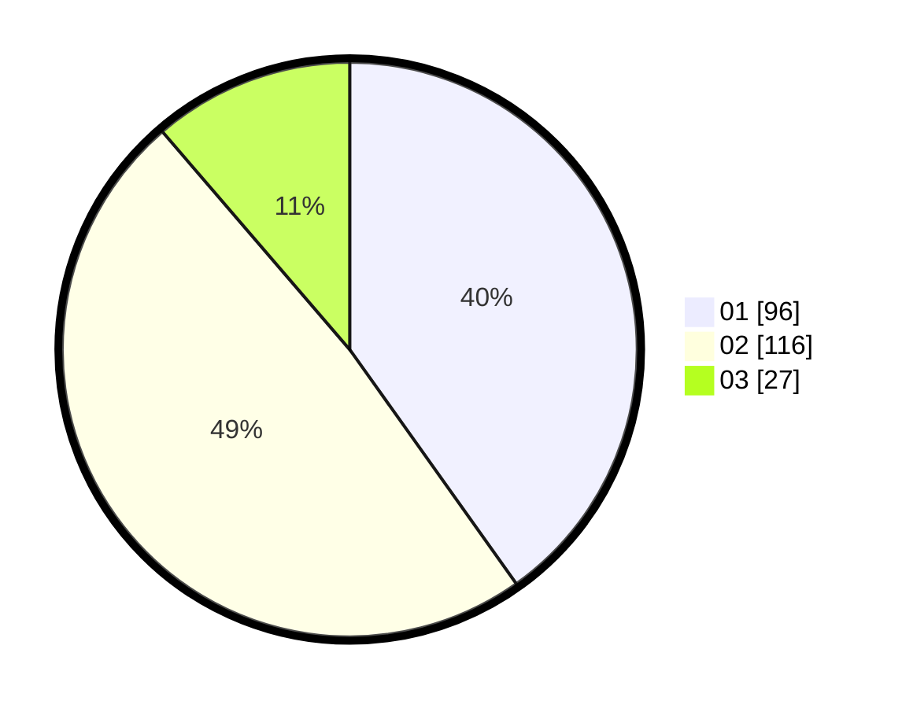

# Hasil

Hasil perolehan suara paslon dapat dilihat pada file paslon-01.txt, paslon-02.txt, dan paslon-03.txt.

Jika tidak ada, artinya data tersebut belum ada pada SIREKAP.

## Perolehan Suara

 * Paslon 01: **96**.
 * Paslon 02: **116**.
 * Paslon 03: **27**.

## Foto C Plano

https://sirekap-obj-formc.kpu.go.id/6ea9/pemilu/ppwp/31/73/06/10/04/3173061004109-20240216-140813--fb0c8ac9-69da-46e8-b079-328e1db04b40.jpg

https://sirekap-obj-formc.kpu.go.id/6ea9/pemilu/ppwp/31/73/06/10/04/3173061004109-20240216-140814--650f0366-4539-43dc-a90b-c9122b424f02.jpg

https://sirekap-obj-formc.kpu.go.id/6ea9/pemilu/ppwp/31/73/06/10/04/3173061004109-20240216-140813--54f834e9-8421-465e-b497-0cb97363cf57.jpg

## DATA PEMILIH TETAP

Jumlah pemilih dalam DPT: **278**.
 * L: **142**.
 * P: **136**.

## DATA PENGGUNA HAK PILIH

Jumlah pengguna hak pilih dalam DPT: **240**.
 * L: **119**.
 * P: **121**.

Jumlah pengguna hak pilih dalam DPTb: **0**.
 * L: **0**.
 * P: **0**.

Jumlah pengguna hak pilih dalam DPK: **0**.
 * L: **0**.
 * P: **0**.

Jumlah pengguna hak pilih: **0**.
 * L: **0**.
 * P: **0**.

## JUMLAH SUARA SAH DAN TIDAK SAH

JUMLAH SELURUH SUARA SAH: **239**.

JUMLAH SUARA TIDAK SAH: **1**.

JUMLAH SELURUH SUARA SAH DAN SUARA TIDAK SAH: **240**.
