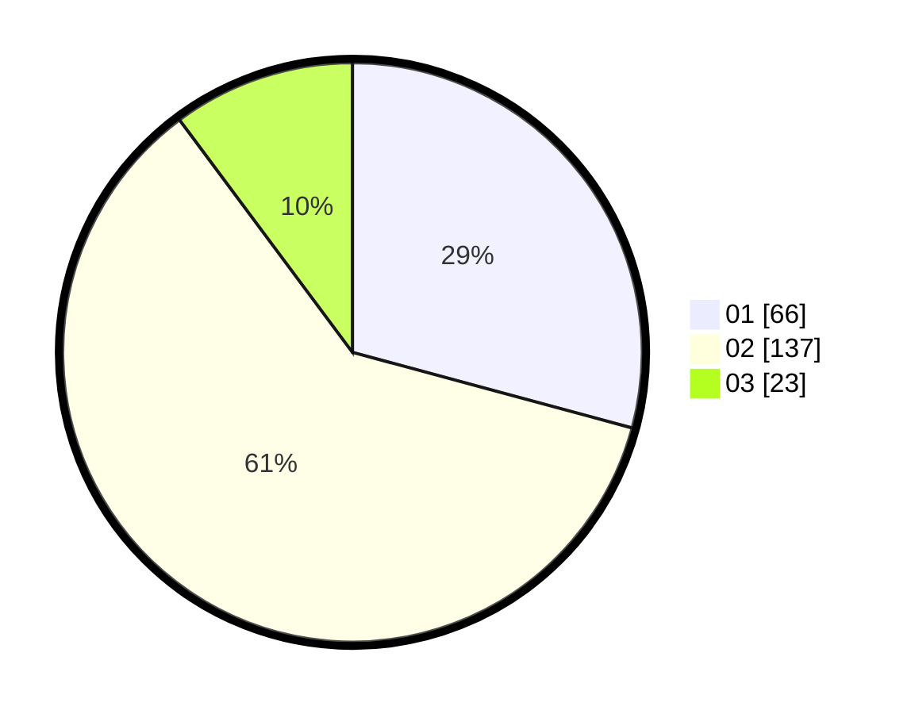

# Hasil

Hasil perolehan suara paslon dapat dilihat pada file paslon-01.txt, paslon-02.txt, dan paslon-03.txt.

Jika tidak ada, artinya data tersebut belum ada pada SIREKAP.

## Perolehan Suara

 * Paslon 01: **66**.
 * Paslon 02: **137**.
 * Paslon 03: **23**.

## Foto C Plano

https://sirekap-obj-formc.kpu.go.id/1c3a/pemilu/ppwp/31/73/06/10/04/3173061004123-20240214-220857--f6344806-19a0-4995-a5e1-1f5abd6e2af3.jpg

https://sirekap-obj-formc.kpu.go.id/1c3a/pemilu/ppwp/31/73/06/10/04/3173061004123-20240214-220947--548269cd-54cf-4b53-866c-ceedf210c81e.jpg

https://sirekap-obj-formc.kpu.go.id/1c3a/pemilu/ppwp/31/73/06/10/04/3173061004123-20240214-221036--69bf0322-d1ec-4a48-853f-380caaa1c3b7.jpg
