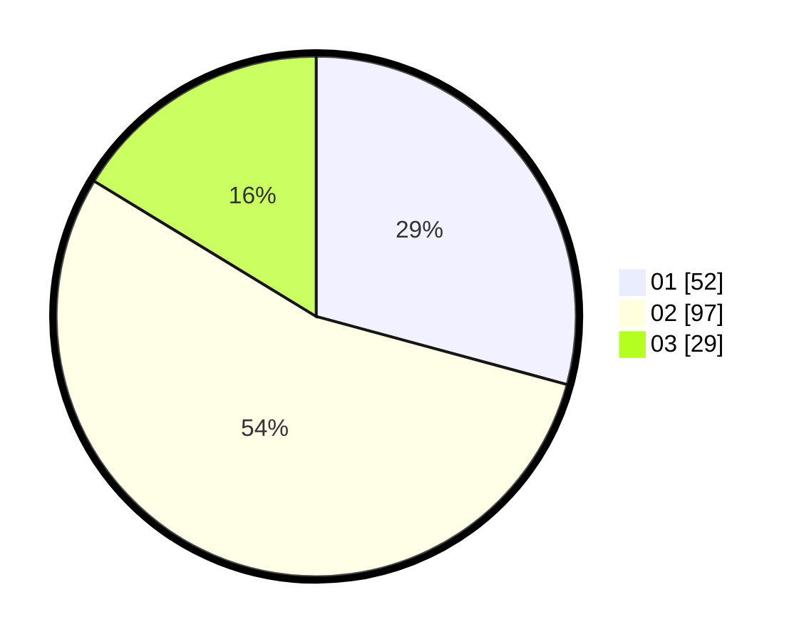

# Hasil

Hasil perolehan suara paslon dapat dilihat pada file paslon-01.txt, paslon-02.txt, dan paslon-03.txt.

Jika tidak ada, artinya data tersebut belum ada pada SIREKAP.

## Perolehan Suara

 * Paslon 01: **52**.
 * Paslon 02: **97**.
 * Paslon 03: **29**.

## Foto C Plano

https://sirekap-obj-formc.kpu.go.id/3ce9/pemilu/ppwp/31/73/06/10/04/3173061004124-20240214-230907--65c53b9a-80b3-4768-aa1f-755f6d52ce43.jpg

https://sirekap-obj-formc.kpu.go.id/3ce9/pemilu/ppwp/31/73/06/10/04/3173061004124-20240214-231015--53197777-8085-4588-9b67-1a603669f9ec.jpg

https://sirekap-obj-formc.kpu.go.id/3ce9/pemilu/ppwp/31/73/06/10/04/3173061004124-20240214-231135--be90c16c-76ed-44d1-a9f2-4b4c93506a2c.jpg
