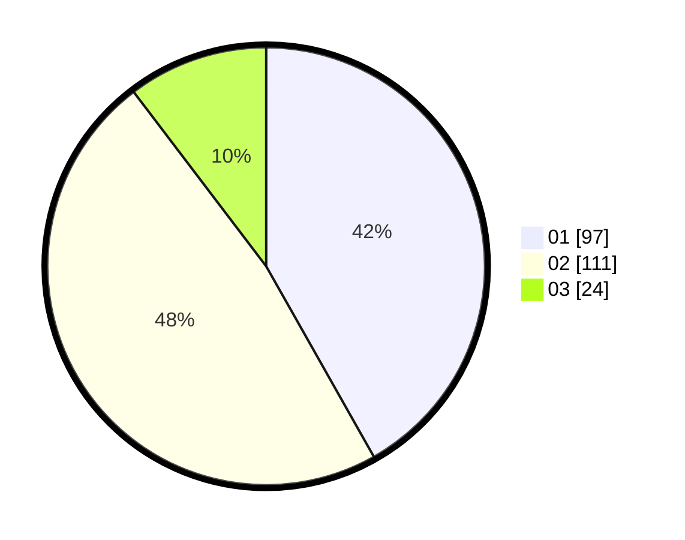

# Hasil

Hasil perolehan suara paslon dapat dilihat pada file paslon-01.txt, paslon-02.txt, dan paslon-03.txt.

Jika tidak ada, artinya data tersebut belum ada pada SIREKAP.

## Perolehan Suara

 * Paslon 01: **97**.
 * Paslon 02: **111**.
 * Paslon 03: **24**.

## Foto C Plano

https://sirekap-obj-formc.kpu.go.id/e237/pemilu/ppwp/31/73/06/10/04/3173061004127-20240214-222247--1cd0b8f4-dc3d-40f4-b9c7-8c5124ea142b.jpg

https://sirekap-obj-formc.kpu.go.id/e237/pemilu/ppwp/31/73/06/10/04/3173061004127-20240214-222323--23356d5e-515e-4a3a-9715-a9d410d1a089.jpg

https://sirekap-obj-formc.kpu.go.id/e237/pemilu/ppwp/31/73/06/10/04/3173061004127-20240214-222351--43a8b205-ab94-4c59-8f98-e09d7bbe2ab3.jpg
