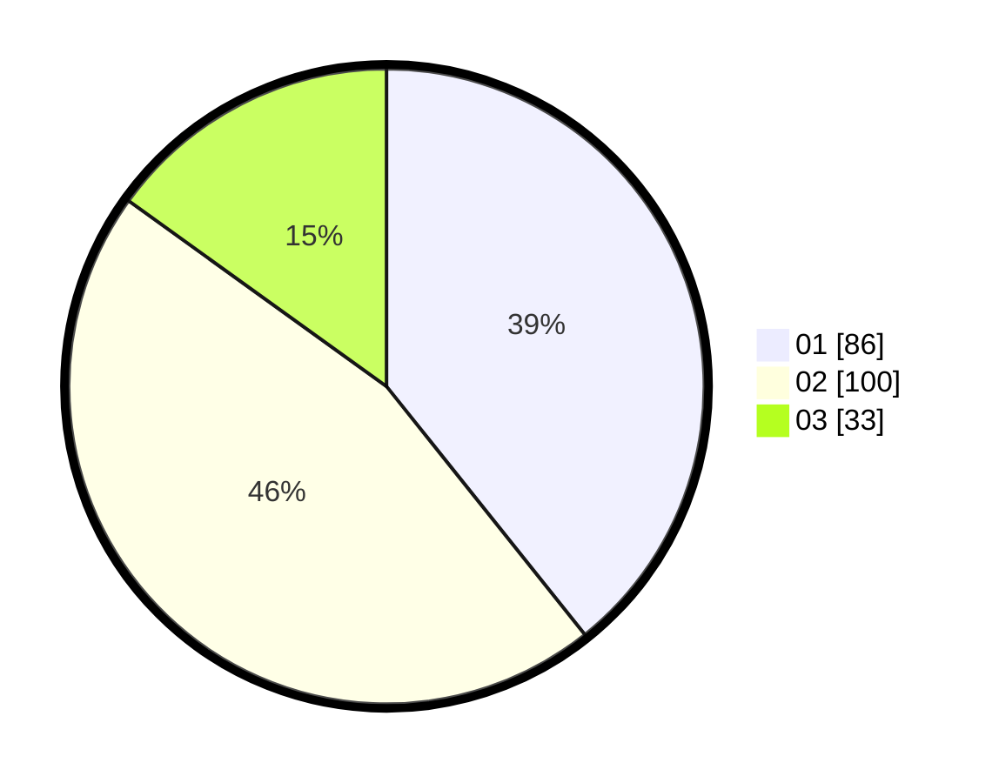

# Hasil

Hasil perolehan suara paslon dapat dilihat pada file paslon-01.txt, paslon-02.txt, dan paslon-03.txt.

Jika tidak ada, artinya data tersebut belum ada pada SIREKAP.

## Perolehan Suara

 * Paslon 01: **86**.
 * Paslon 02: **100**.
 * Paslon 03: **33**.

## Foto C Plano

https://sirekap-obj-formc.kpu.go.id/96e1/pemilu/ppwp/31/73/06/10/04/3173061004129-20240215-123019--158f4cdd-8d23-424a-a270-c70d2bd95d66.jpg

https://sirekap-obj-formc.kpu.go.id/96e1/pemilu/ppwp/31/73/06/10/04/3173061004129-20240215-123020--c5ddee8a-b61d-4bd8-bfcf-30210bb70acf.jpg

https://sirekap-obj-formc.kpu.go.id/96e1/pemilu/ppwp/31/73/06/10/04/3173061004129-20240215-123020--e96b5fb2-b124-4e3b-abe4-f81062f2f476.jpg

## DATA PEMILIH TETAP

Jumlah pemilih dalam DPT: **297**.
 * L: **157**.
 * P: **140**.

## DATA PENGGUNA HAK PILIH

Jumlah pengguna hak pilih dalam DPT: **216**.
 * L: **110**.
 * P: **106**.

Jumlah pengguna hak pilih dalam DPTb: **0**.
 * L: **0**.
 * P: **0**.

Jumlah pengguna hak pilih dalam DPK: **4**.
 * L: **3**.
 * P: **1**.

Jumlah pengguna hak pilih: **220**.
 * L: **113**.
 * P: **107**.

## JUMLAH SUARA SAH DAN TIDAK SAH

JUMLAH SELURUH SUARA SAH: **219**.

JUMLAH SUARA TIDAK SAH: **1**.

JUMLAH SELURUH SUARA SAH DAN SUARA TIDAK SAH: **220**.
