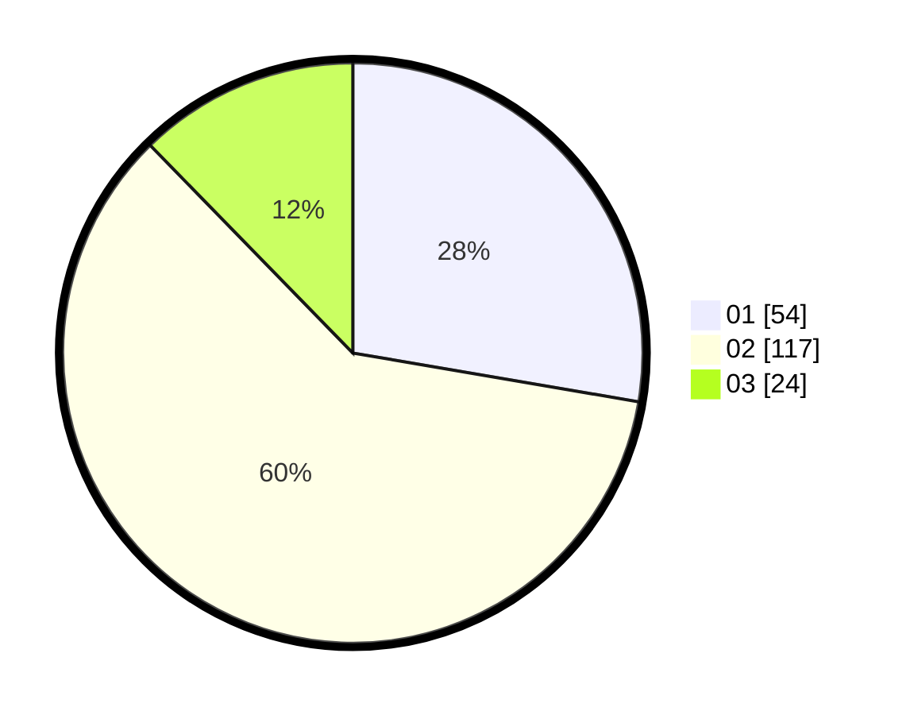

# Hasil

Hasil perolehan suara paslon dapat dilihat pada file paslon-01.txt, paslon-02.txt, dan paslon-03.txt.

Jika tidak ada, artinya data tersebut belum ada pada SIREKAP.

## Perolehan Suara

 * Paslon 01: **54**.
 * Paslon 02: **117**.
 * Paslon 03: **24**.

## Foto C Plano

https://sirekap-obj-formc.kpu.go.id/4212/pemilu/ppwp/31/73/06/10/04/3173061004130-20240216-005623--2bd1f78e-73b0-4b4d-ac5b-2e9faef29bf4.jpg

https://sirekap-obj-formc.kpu.go.id/4212/pemilu/ppwp/31/73/06/10/04/3173061004130-20240216-005630--69e70895-143f-4cce-b499-15478e34503b.jpg

https://sirekap-obj-formc.kpu.go.id/4212/pemilu/ppwp/31/73/06/10/04/3173061004130-20240216-005629--dafdaf32-43ae-4e90-828d-342eeeadd1c4.jpg

## DATA PEMILIH TETAP

Jumlah pemilih dalam DPT: **292**.
 * L: **147**.
 * P: **145**.

## DATA PENGGUNA HAK PILIH

Jumlah pengguna hak pilih dalam DPT: **199**.
 * L: **100**.
 * P: **99**.

Jumlah pengguna hak pilih dalam DPTb: **0**.
 * L: **0**.
 * P: **0**.

Jumlah pengguna hak pilih dalam DPK: **1**.
 * L: **0**.
 * P: **1**.

Jumlah pengguna hak pilih: **200**.
 * L: **100**.
 * P: **100**.

## JUMLAH SUARA SAH DAN TIDAK SAH

JUMLAH SELURUH SUARA SAH: **195**.

JUMLAH SUARA TIDAK SAH: **5**.

JUMLAH SELURUH SUARA SAH DAN SUARA TIDAK SAH: **200**.
