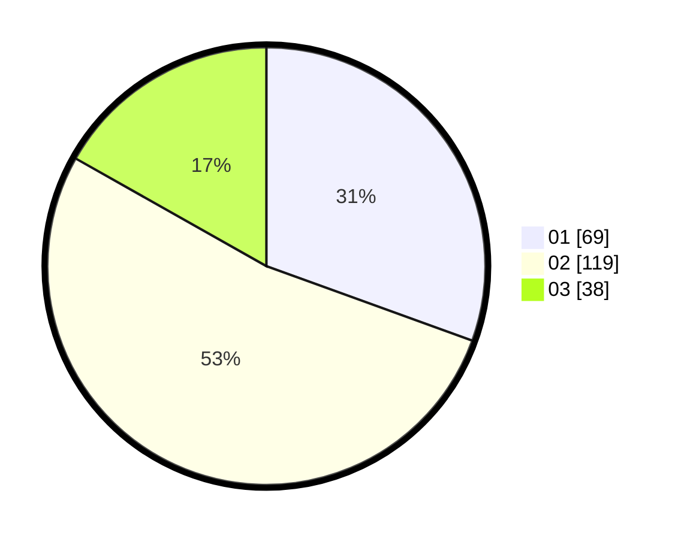

# Hasil

Hasil perolehan suara paslon dapat dilihat pada file paslon-01.txt, paslon-02.txt, dan paslon-03.txt.

Jika tidak ada, artinya data tersebut belum ada pada SIREKAP.

## Perolehan Suara

 * Paslon 01: **69**.
 * Paslon 02: **119**.
 * Paslon 03: **38**.

## Foto C Plano

https://sirekap-obj-formc.kpu.go.id/6cd0/pemilu/ppwp/31/73/06/10/04/3173061004132-20240215-133916--bb6819b5-0de8-430a-9e58-bad77b05081f.jpg

https://sirekap-obj-formc.kpu.go.id/6cd0/pemilu/ppwp/31/73/06/10/04/3173061004132-20240215-133939--5577e44d-7b60-4d76-9a90-d2bbf77e0082.jpg

https://sirekap-obj-formc.kpu.go.id/6cd0/pemilu/ppwp/31/73/06/10/04/3173061004132-20240215-133928--382a2314-9ebb-4880-aa31-7abb2827ea45.jpg

## DATA PEMILIH TETAP

Jumlah pemilih dalam DPT: **295**.
 * L: **140**.
 * P: **155**.

## DATA PENGGUNA HAK PILIH

Jumlah pengguna hak pilih dalam DPT: **234**.
 * L: **115**.
 * P: **119**.

Jumlah pengguna hak pilih dalam DPTb: **0**.
 * L: **0**.
 * P: **0**.

Jumlah pengguna hak pilih dalam DPK: **3**.
 * L: **2**.
 * P: **1**.

Jumlah pengguna hak pilih: **237**.
 * L: **117**.
 * P: **120**.

## JUMLAH SUARA SAH DAN TIDAK SAH

JUMLAH SELURUH SUARA SAH: **226**.

JUMLAH SUARA TIDAK SAH: **11**.

JUMLAH SELURUH SUARA SAH DAN SUARA TIDAK SAH: **237**.
