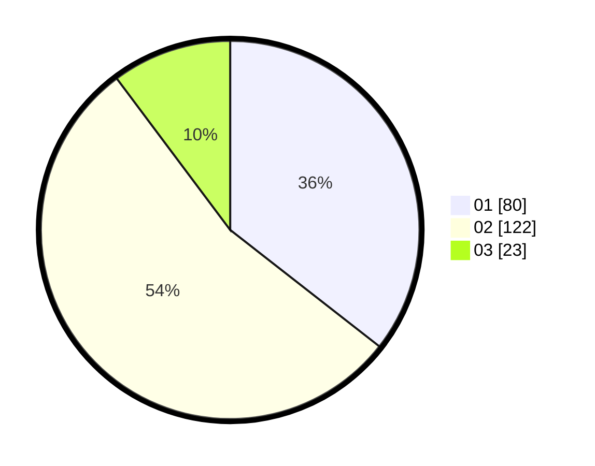

# Hasil

Hasil perolehan suara paslon dapat dilihat pada file paslon-01.txt, paslon-02.txt, dan paslon-03.txt.

Jika tidak ada, artinya data tersebut belum ada pada SIREKAP.

## Perolehan Suara

 * Paslon 01: **80**.
 * Paslon 02: **122**.
 * Paslon 03: **23**.

## Foto C Plano

https://sirekap-obj-formc.kpu.go.id/e6e2/pemilu/ppwp/31/73/06/10/04/3173061004138-20240215-231517--b07ceaa4-f3a9-47f2-a516-e0ec73934e85.jpg

https://sirekap-obj-formc.kpu.go.id/e6e2/pemilu/ppwp/31/73/06/10/04/3173061004138-20240215-231520--c7ed3c4a-8f0e-4d7b-b674-289fa7e6acc6.jpg

https://sirekap-obj-formc.kpu.go.id/e6e2/pemilu/ppwp/31/73/06/10/04/3173061004138-20240215-231519--0c4bf828-7872-4209-8c0d-2bbb3f0457f6.jpg

## DATA PEMILIH TETAP

Jumlah pemilih dalam DPT: **290**.
 * L: **148**.
 * P: **142**.

## DATA PENGGUNA HAK PILIH

Jumlah pengguna hak pilih dalam DPT: **229**.
 * L: **114**.
 * P: **115**.

Jumlah pengguna hak pilih dalam DPTb: **0**.
 * L: **0**.
 * P: **0**.

Jumlah pengguna hak pilih dalam DPK: **0**.
 * L: **0**.
 * P: **0**.

Jumlah pengguna hak pilih: **229**.
 * L: **114**.
 * P: **115**.

## JUMLAH SUARA SAH DAN TIDAK SAH

JUMLAH SELURUH SUARA SAH: **225**.

JUMLAH SUARA TIDAK SAH: **4**.

JUMLAH SELURUH SUARA SAH DAN SUARA TIDAK SAH: **229**.
