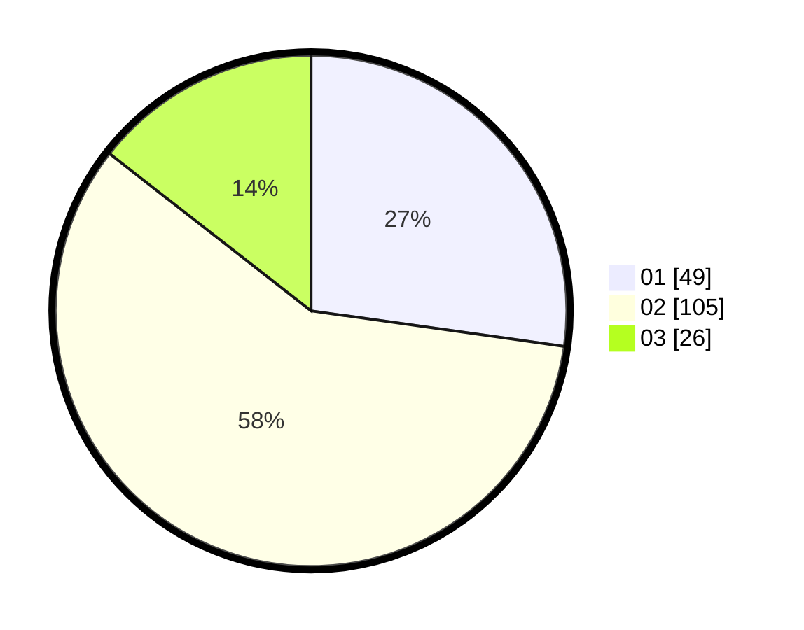

# Hasil

Hasil perolehan suara paslon dapat dilihat pada file paslon-01.txt, paslon-02.txt, dan paslon-03.txt.

Jika tidak ada, artinya data tersebut belum ada pada SIREKAP.

## Perolehan Suara

 * Paslon 01: **49**.
 * Paslon 02: **105**.
 * Paslon 03: **26**.

## Foto C Plano

https://sirekap-obj-formc.kpu.go.id/3d84/pemilu/ppwp/31/73/06/10/04/3173061004141-20240214-223522--0131f8b4-15cd-49aa-bf65-cf16941e8078.jpg

https://sirekap-obj-formc.kpu.go.id/3d84/pemilu/ppwp/31/73/06/10/04/3173061004141-20240214-220129--cfae4786-12f7-4318-a908-8abb4531d6d7.jpg

https://sirekap-obj-formc.kpu.go.id/3d84/pemilu/ppwp/31/73/06/10/04/3173061004141-20240214-223639--c1161b9c-bd45-4bf2-8970-acf55459bb70.jpg
