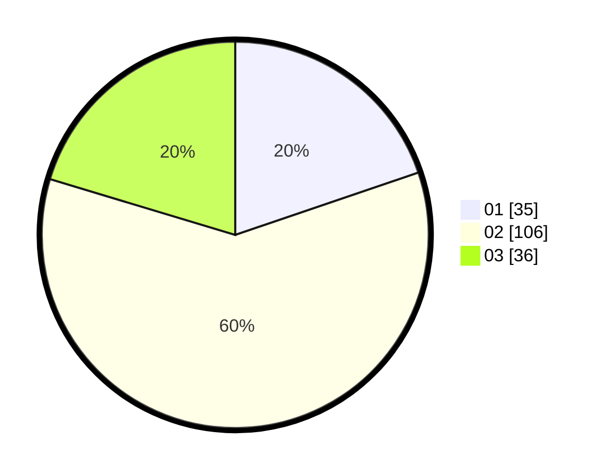

# Hasil

Hasil perolehan suara paslon dapat dilihat pada file paslon-01.txt, paslon-02.txt, dan paslon-03.txt.

Jika tidak ada, artinya data tersebut belum ada pada SIREKAP.

## Perolehan Suara

 * Paslon 01: **35**.
 * Paslon 02: **106**.
 * Paslon 03: **36**.

## Foto C Plano

https://sirekap-obj-formc.kpu.go.id/27ea/pemilu/ppwp/31/73/06/10/04/3173061004143-20240215-010041--1ce51b05-d826-40bf-b144-c4e6112d8d4e.jpg

https://sirekap-obj-formc.kpu.go.id/27ea/pemilu/ppwp/31/73/06/10/04/3173061004143-20240215-010145--796bb990-dc40-4c98-8bec-e55fef1e3d21.jpg

https://sirekap-obj-formc.kpu.go.id/27ea/pemilu/ppwp/31/73/06/10/04/3173061004143-20240214-212458--7219288d-f52f-4540-82b4-7f3bd5607612.jpg
