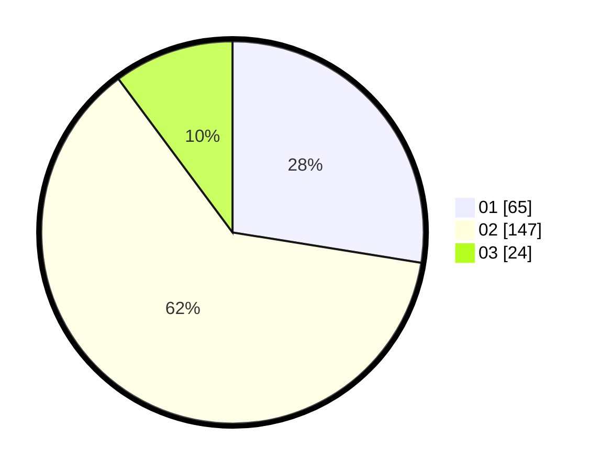

# Hasil

Hasil perolehan suara paslon dapat dilihat pada file paslon-01.txt, paslon-02.txt, dan paslon-03.txt.

Jika tidak ada, artinya data tersebut belum ada pada SIREKAP.

## Perolehan Suara

 * Paslon 01: **65**.
 * Paslon 02: **147**.
 * Paslon 03: **24**.

## Foto C Plano

https://sirekap-obj-formc.kpu.go.id/2774/pemilu/ppwp/31/73/06/10/04/3173061004144-20240214-190447--49162930-927d-4fef-a2a7-ce22e41c374a.jpg

https://sirekap-obj-formc.kpu.go.id/2774/pemilu/ppwp/31/73/06/10/04/3173061004144-20240214-195022--9b6cdc66-cb85-4f69-8ccb-d9390eedabff.jpg

https://sirekap-obj-formc.kpu.go.id/2774/pemilu/ppwp/31/73/06/10/04/3173061004144-20240216-002805--b0db7808-26e7-4e0e-a90e-e8155a59b9f0.jpg

## DATA PEMILIH TETAP

Jumlah pemilih dalam DPT: **292**.
 * L: **143**.
 * P: **149**.

## DATA PENGGUNA HAK PILIH

Jumlah pengguna hak pilih dalam DPT: **240**.
 * L: **115**.
 * P: **125**.

Jumlah pengguna hak pilih dalam DPTb: **0**.
 * L: **0**.
 * P: **0**.

Jumlah pengguna hak pilih dalam DPK: **10**.
 * L: **5**.
 * P: **5**.

Jumlah pengguna hak pilih: **250**.
 * L: **120**.
 * P: **130**.

## JUMLAH SUARA SAH DAN TIDAK SAH

JUMLAH SELURUH SUARA SAH: **236**.

JUMLAH SUARA TIDAK SAH: **14**.

JUMLAH SELURUH SUARA SAH DAN SUARA TIDAK SAH: **250**.
