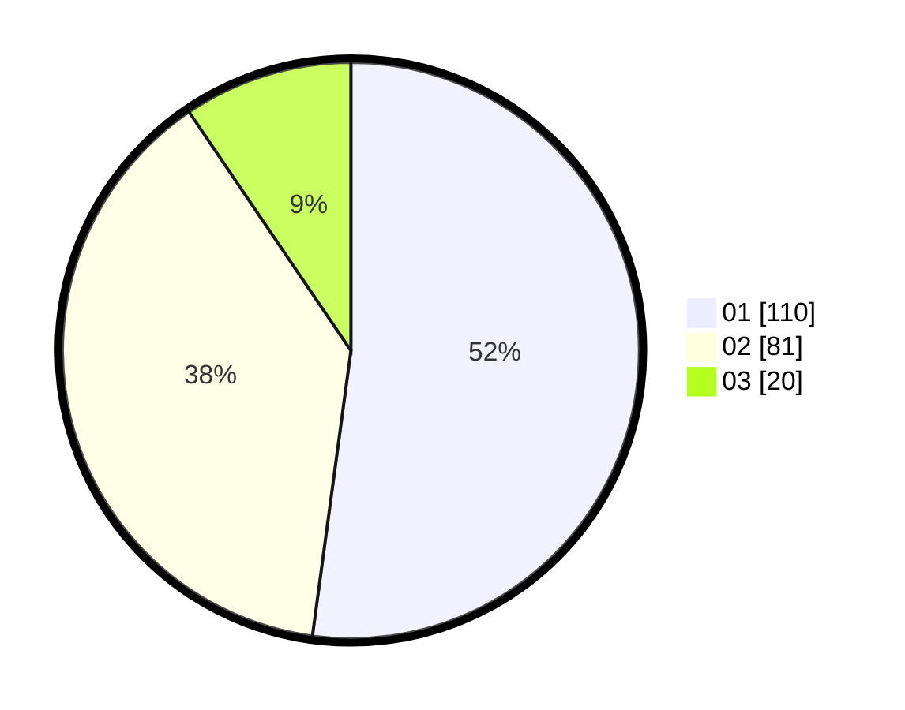

# Hasil

Hasil perolehan suara paslon dapat dilihat pada file paslon-01.txt, paslon-02.txt, dan paslon-03.txt.

Jika tidak ada, artinya data tersebut belum ada pada SIREKAP.

## Perolehan Suara

 * Paslon 01: **110**.
 * Paslon 02: **81**.
 * Paslon 03: **20**.

## Foto C Plano

https://sirekap-obj-formc.kpu.go.id/9533/pemilu/ppwp/31/73/06/10/04/3173061004149-20240216-154551--9f12456d-999f-4737-9354-81f60aa6a37a.jpg

https://sirekap-obj-formc.kpu.go.id/9533/pemilu/ppwp/31/73/06/10/04/3173061004149-20240216-154552--0b4be596-5bdc-46f7-ace2-3e01260a925b.jpg

https://sirekap-obj-formc.kpu.go.id/9533/pemilu/ppwp/31/73/06/10/04/3173061004149-20240216-082610--74021efd-7af4-43e5-b67e-974bedf79ead.jpg

## DATA PEMILIH TETAP

Jumlah pemilih dalam DPT: **210**.
 * L: **99**.
 * P: **111**.

## DATA PENGGUNA HAK PILIH

Jumlah pengguna hak pilih dalam DPT: **210**.
 * L: **99**.
 * P: **111**.

Jumlah pengguna hak pilih dalam DPTb: **3**.
 * L: **1**.
 * P: **2**.

Jumlah pengguna hak pilih dalam DPK: **1**.
 * L: **0**.
 * P: **1**.

Jumlah pengguna hak pilih: **214**.
 * L: **100**.
 * P: **114**.

## JUMLAH SUARA SAH DAN TIDAK SAH

JUMLAH SELURUH SUARA SAH: **211**.

JUMLAH SUARA TIDAK SAH: **3**.

JUMLAH SELURUH SUARA SAH DAN SUARA TIDAK SAH: **214**.
