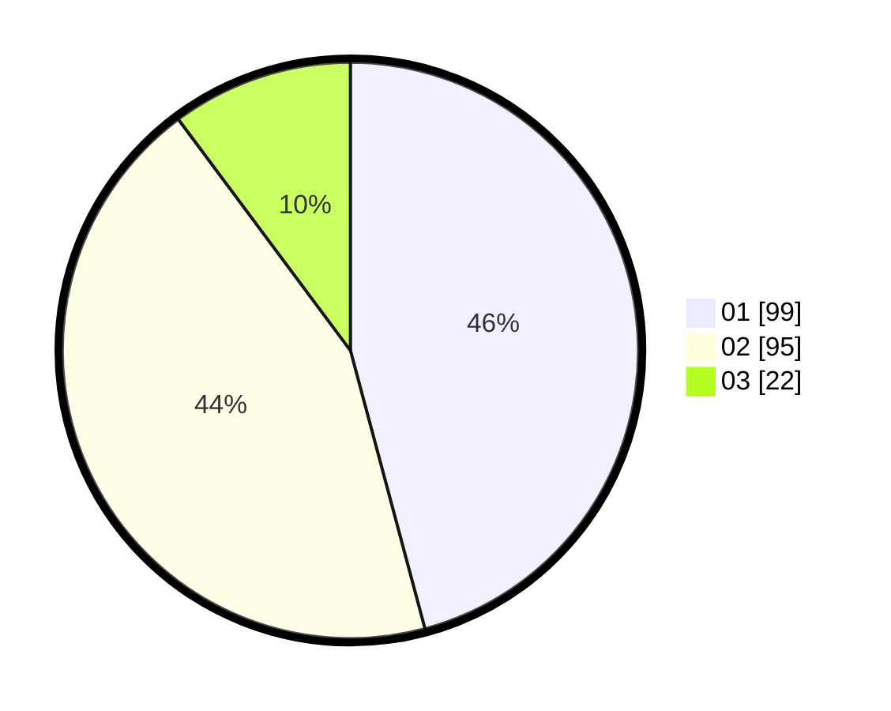

# Hasil

Hasil perolehan suara paslon dapat dilihat pada file paslon-01.txt, paslon-02.txt, dan paslon-03.txt.

Jika tidak ada, artinya data tersebut belum ada pada SIREKAP.

## Perolehan Suara

 * Paslon 01: **99**.
 * Paslon 02: **95**.
 * Paslon 03: **22**.

## Foto C Plano

https://sirekap-obj-formc.kpu.go.id/2376/pemilu/ppwp/31/73/06/10/04/3173061004152-20240214-185656--0348b533-7d02-4491-9104-cf8e27902091.jpg

https://sirekap-obj-formc.kpu.go.id/2376/pemilu/ppwp/31/73/06/10/04/3173061004152-20240214-185748--0d94d839-ab84-4c98-a532-31d6936acfb0.jpg

https://sirekap-obj-formc.kpu.go.id/2376/pemilu/ppwp/31/73/06/10/04/3173061004152-20240214-185831--f05f7a7f-2590-46b4-8de2-986d5e6823e8.jpg

## DATA PEMILIH TETAP

Jumlah pemilih dalam DPT: **268**.
 * L: **140**.
 * P: **128**.

## DATA PENGGUNA HAK PILIH

Jumlah pengguna hak pilih dalam DPT: **221**.
 * L: **115**.
 * P: **106**.

Jumlah pengguna hak pilih dalam DPTb: **2**.
 * L: **1**.
 * P: **1**.

Jumlah pengguna hak pilih dalam DPK: **0**.
 * L: **0**.
 * P: **0**.

Jumlah pengguna hak pilih: **223**.
 * L: **116**.
 * P: **107**.

## JUMLAH SUARA SAH DAN TIDAK SAH

JUMLAH SELURUH SUARA SAH: **216**.

JUMLAH SUARA TIDAK SAH: **7**.

JUMLAH SELURUH SUARA SAH DAN SUARA TIDAK SAH: **223**.
