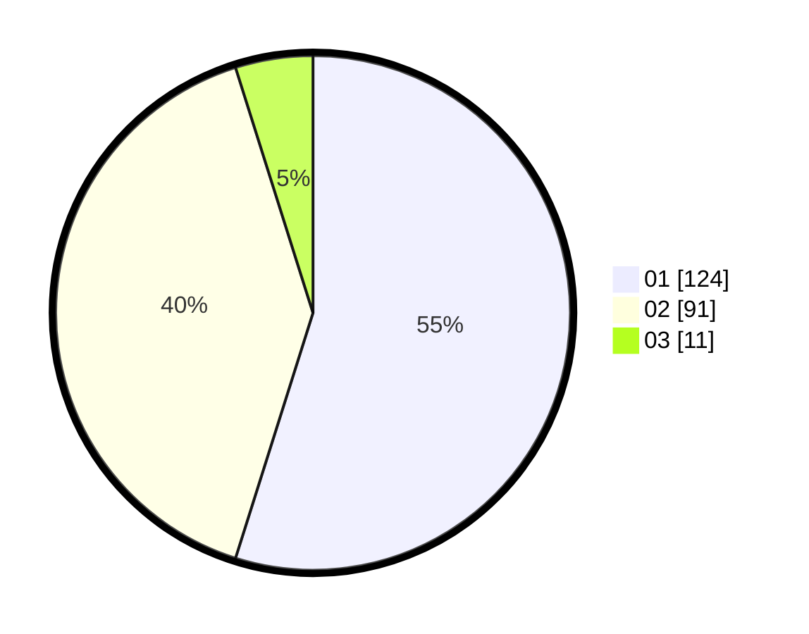

# Hasil

Hasil perolehan suara paslon dapat dilihat pada file paslon-01.txt, paslon-02.txt, dan paslon-03.txt.

Jika tidak ada, artinya data tersebut belum ada pada SIREKAP.

## Perolehan Suara

 * Paslon 01: **124**.
 * Paslon 02: **91**.
 * Paslon 03: **11**.

## Foto C Plano

https://sirekap-obj-formc.kpu.go.id/2fc7/pemilu/ppwp/31/73/06/10/04/3173061004156-20240214-195215--d1c24861-cbf1-4a6c-a2c3-f11149a4ea15.jpg

https://sirekap-obj-formc.kpu.go.id/2fc7/pemilu/ppwp/31/73/06/10/04/3173061004156-20240215-231144--f241c35f-d49f-4595-a6cf-c1b4b2cee149.jpg

https://sirekap-obj-formc.kpu.go.id/2fc7/pemilu/ppwp/31/73/06/10/04/3173061004156-20240214-195557--83227776-517e-4c0d-a6b1-8765b43a9bc8.jpg
