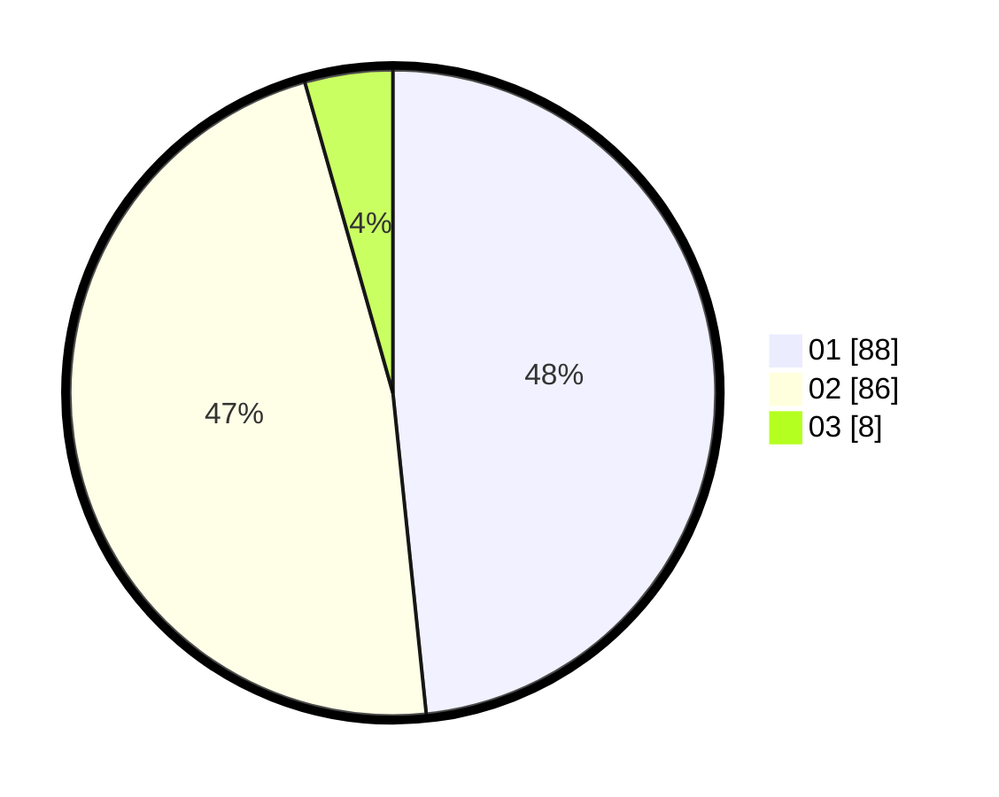

# Hasil

Hasil perolehan suara paslon dapat dilihat pada file paslon-01.txt, paslon-02.txt, dan paslon-03.txt.

Jika tidak ada, artinya data tersebut belum ada pada SIREKAP.

## Perolehan Suara

 * Paslon 01: **88**.
 * Paslon 02: **86**.
 * Paslon 03: **8**.

## Foto C Plano

https://sirekap-obj-formc.kpu.go.id/7892/pemilu/ppwp/31/73/06/10/04/3173061004161-20240215-215251--bb305aaa-9cff-4250-8ac2-041342db0584.jpg

https://sirekap-obj-formc.kpu.go.id/7892/pemilu/ppwp/31/73/06/10/04/3173061004161-20240215-215254--415db365-4167-4ce1-8210-a9204cb3e8e2.jpg

https://sirekap-obj-formc.kpu.go.id/7892/pemilu/ppwp/31/73/06/10/04/3173061004161-20240215-215252--8dc1da76-92eb-4e13-8ee3-76d4474b6f24.jpg

## DATA PEMILIH TETAP

Jumlah pemilih dalam DPT: **231**.
 * L: **105**.
 * P: **126**.

## DATA PENGGUNA HAK PILIH

Jumlah pengguna hak pilih dalam DPT: **177**.
 * L: **82**.
 * P: **95**.

Jumlah pengguna hak pilih dalam DPTb: **5**.
 * L: **4**.
 * P: **1**.

Jumlah pengguna hak pilih dalam DPK: **1**.
 * L: **0**.
 * P: **1**.

Jumlah pengguna hak pilih: **183**.
 * L: **86**.
 * P: **97**.

## JUMLAH SUARA SAH DAN TIDAK SAH

JUMLAH SELURUH SUARA SAH: **182**.

JUMLAH SUARA TIDAK SAH: **1**.

JUMLAH SELURUH SUARA SAH DAN SUARA TIDAK SAH: **183**.
