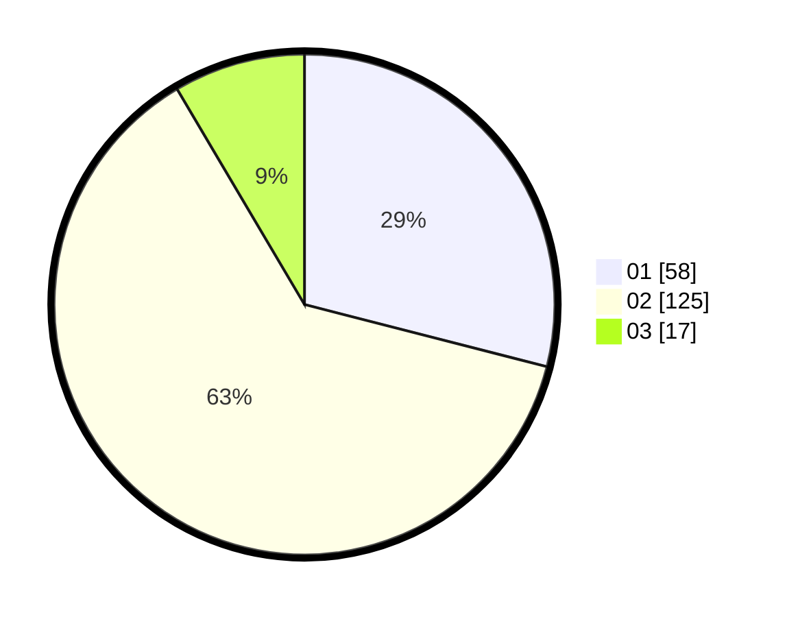

# Hasil

Hasil perolehan suara paslon dapat dilihat pada file paslon-01.txt, paslon-02.txt, dan paslon-03.txt.

Jika tidak ada, artinya data tersebut belum ada pada SIREKAP.

## Perolehan Suara

 * Paslon 01: **58**.
 * Paslon 02: **125**.
 * Paslon 03: **17**.

## Foto C Plano

https://sirekap-obj-formc.kpu.go.id/7a0d/pemilu/ppwp/31/73/06/10/04/3173061004162-20240216-142845--0428c9ce-16da-4714-81d1-b4ee8bd0094a.jpg

https://sirekap-obj-formc.kpu.go.id/7a0d/pemilu/ppwp/31/73/06/10/04/3173061004162-20240216-142846--9369f8cc-812e-4e0c-84aa-88a1fc38a61e.jpg

https://sirekap-obj-formc.kpu.go.id/7a0d/pemilu/ppwp/31/73/06/10/04/3173061004162-20240216-142846--6559691b-1792-4fe6-ace2-37f525d3a54b.jpg

## DATA PEMILIH TETAP

Jumlah pemilih dalam DPT: **260**.
 * L: **131**.
 * P: **129**.

## DATA PENGGUNA HAK PILIH

Jumlah pengguna hak pilih dalam DPT: **200**.
 * L: **97**.
 * P: **103**.

Jumlah pengguna hak pilih dalam DPTb: **0**.
 * L: **0**.
 * P: **0**.

Jumlah pengguna hak pilih dalam DPK: **1**.
 * L: **0**.
 * P: **1**.

Jumlah pengguna hak pilih: **201**.
 * L: **97**.
 * P: **104**.

## JUMLAH SUARA SAH DAN TIDAK SAH

JUMLAH SELURUH SUARA SAH: **200**.

JUMLAH SUARA TIDAK SAH: **1**.

JUMLAH SELURUH SUARA SAH DAN SUARA TIDAK SAH: **201**.
