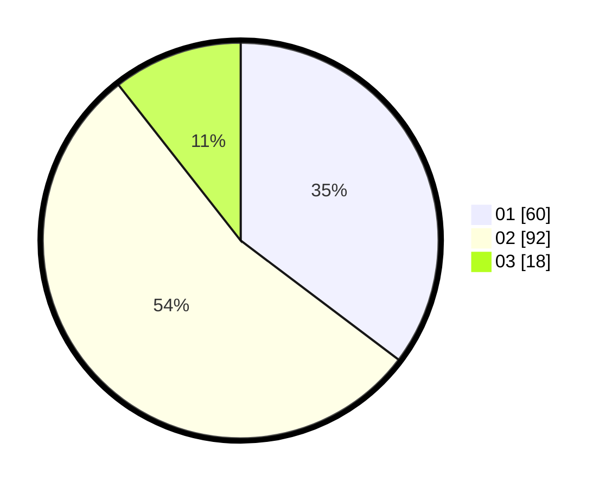

# Hasil

Hasil perolehan suara paslon dapat dilihat pada file paslon-01.txt, paslon-02.txt, dan paslon-03.txt.

Jika tidak ada, artinya data tersebut belum ada pada SIREKAP.

## Perolehan Suara

 * Paslon 01: **60**.
 * Paslon 02: **92**.
 * Paslon 03: **18**.

## Foto C Plano

https://sirekap-obj-formc.kpu.go.id/bfb5/pemilu/ppwp/31/73/06/10/04/3173061004165-20240215-025446--7ef5d3c4-4ac2-491d-9165-a4112e74920a.jpg

https://sirekap-obj-formc.kpu.go.id/bfb5/pemilu/ppwp/31/73/06/10/04/3173061004165-20240215-025507--e749d82a-841c-4e0f-b506-2715bd9106f0.jpg

https://sirekap-obj-formc.kpu.go.id/bfb5/pemilu/ppwp/31/73/06/10/04/3173061004165-20240215-025456--396be5e1-0292-4b64-9ce3-c3bb69e66bb3.jpg

## DATA PEMILIH TETAP

Jumlah pemilih dalam DPT: **220**.
 * L: **120**.
 * P: **100**.

## DATA PENGGUNA HAK PILIH

Jumlah pengguna hak pilih dalam DPT: **175**.
 * L: **92**.
 * P: **83**.

Jumlah pengguna hak pilih dalam DPTb: **0**.
 * L: **0**.
 * P: **0**.

Jumlah pengguna hak pilih dalam DPK: **0**.
 * L: **0**.
 * P: **0**.

Jumlah pengguna hak pilih: **175**.
 * L: **92**.
 * P: **83**.

## JUMLAH SUARA SAH DAN TIDAK SAH

JUMLAH SELURUH SUARA SAH: **170**.

JUMLAH SUARA TIDAK SAH: **5**.

JUMLAH SELURUH SUARA SAH DAN SUARA TIDAK SAH: **175**.
