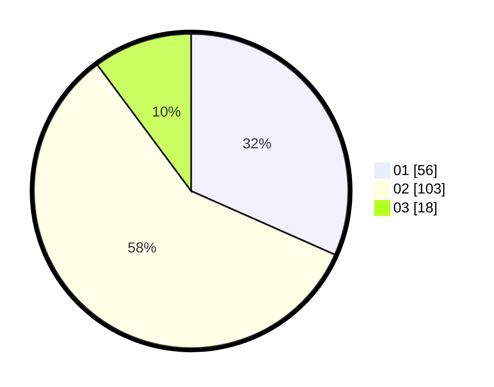

# Hasil

Hasil perolehan suara paslon dapat dilihat pada file paslon-01.txt, paslon-02.txt, dan paslon-03.txt.

Jika tidak ada, artinya data tersebut belum ada pada SIREKAP.

## Perolehan Suara

 * Paslon 01: **56**.
 * Paslon 02: **103**.
 * Paslon 03: **18**.

## Foto C Plano

https://sirekap-obj-formc.kpu.go.id/b5a3/pemilu/ppwp/31/73/06/10/04/3173061004166-20240215-222003--90aa8282-c172-4436-b22f-42662fa18a0b.jpg

https://sirekap-obj-formc.kpu.go.id/b5a3/pemilu/ppwp/31/73/06/10/04/3173061004166-20240215-222005--a2b45395-cd20-4241-8a78-5413d5ea2ae8.jpg

https://sirekap-obj-formc.kpu.go.id/b5a3/pemilu/ppwp/31/73/06/10/04/3173061004166-20240215-222004--ebd23df8-4324-430a-8e60-43ea57664452.jpg

## DATA PEMILIH TETAP

Jumlah pemilih dalam DPT: **226**.
 * L: **120**.
 * P: **106**.

## DATA PENGGUNA HAK PILIH

Jumlah pengguna hak pilih dalam DPT: **177**.
 * L: **89**.
 * P: **88**.

Jumlah pengguna hak pilih dalam DPTb: **0**.
 * L: **0**.
 * P: **0**.

Jumlah pengguna hak pilih dalam DPK: **0**.
 * L: **0**.
 * P: **0**.

Jumlah pengguna hak pilih: **177**.
 * L: **89**.
 * P: **88**.

## JUMLAH SUARA SAH DAN TIDAK SAH

JUMLAH SELURUH SUARA SAH: **177**.

JUMLAH SUARA TIDAK SAH: **0**.

JUMLAH SELURUH SUARA SAH DAN SUARA TIDAK SAH: **177**.
