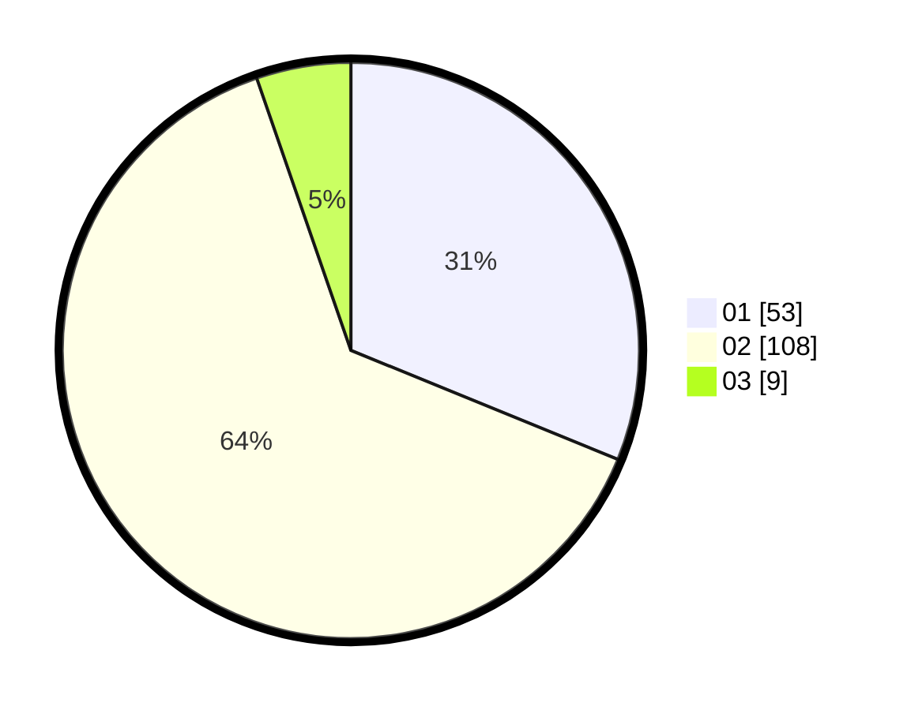

# Hasil

Hasil perolehan suara paslon dapat dilihat pada file paslon-01.txt, paslon-02.txt, dan paslon-03.txt.

Jika tidak ada, artinya data tersebut belum ada pada SIREKAP.

## Perolehan Suara

 * Paslon 01: **53**.
 * Paslon 02: **108**.
 * Paslon 03: **9**.

## Foto C Plano

https://sirekap-obj-formc.kpu.go.id/6fae/pemilu/ppwp/31/73/06/10/04/3173061004167-20240215-103346--4db55288-d91d-4ce5-9675-0d57fdab097e.jpg

https://sirekap-obj-formc.kpu.go.id/6fae/pemilu/ppwp/31/73/06/10/04/3173061004167-20240216-005722--9611ac7d-ac3d-4424-ad8d-f4ef4c0a4aef.jpg

https://sirekap-obj-formc.kpu.go.id/6fae/pemilu/ppwp/31/73/06/10/04/3173061004167-20240216-005721--50ff0dc6-e8da-487b-9827-a9b18207c14f.jpg

## DATA PEMILIH TETAP

Jumlah pemilih dalam DPT: **221**.
 * L: **104**.
 * P: **117**.

## DATA PENGGUNA HAK PILIH

Jumlah pengguna hak pilih dalam DPT: **221**.
 * L: **104**.
 * P: **117**.

Jumlah pengguna hak pilih dalam DPTb: **0**.
 * L: **0**.
 * P: **0**.

Jumlah pengguna hak pilih dalam DPK: **0**.
 * L: **0**.
 * P: **0**.

Jumlah pengguna hak pilih: **221**.
 * L: **104**.
 * P: **117**.

## JUMLAH SUARA SAH DAN TIDAK SAH

JUMLAH SELURUH SUARA SAH: **170**.

JUMLAH SUARA TIDAK SAH: **5**.

JUMLAH SELURUH SUARA SAH DAN SUARA TIDAK SAH: **175**.
