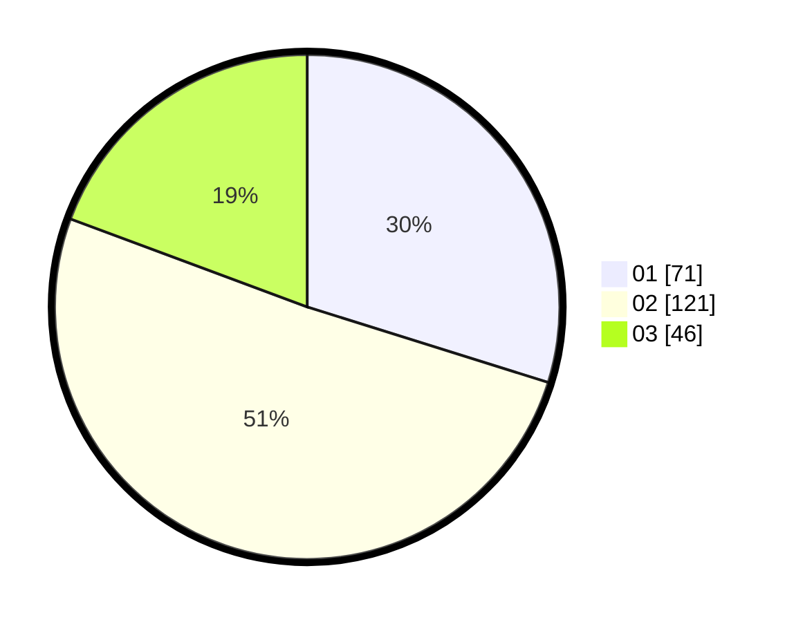

# Hasil

Hasil perolehan suara paslon dapat dilihat pada file paslon-01.txt, paslon-02.txt, dan paslon-03.txt.

Jika tidak ada, artinya data tersebut belum ada pada SIREKAP.

## Perolehan Suara

 * Paslon 01: **71**.
 * Paslon 02: **121**.
 * Paslon 03: **46**.

## Foto C Plano

https://sirekap-obj-formc.kpu.go.id/b62c/pemilu/ppwp/31/73/06/10/04/3173061004169-20240214-204842--77446050-c9f2-4865-89b7-5c968c11f895.jpg

https://sirekap-obj-formc.kpu.go.id/b62c/pemilu/ppwp/31/73/06/10/04/3173061004169-20240214-204950--2716639a-a3e9-4d54-911a-8a3f020ba568.jpg

https://sirekap-obj-formc.kpu.go.id/b62c/pemilu/ppwp/31/73/06/10/04/3173061004169-20240214-205037--e3cdc99f-4d7b-41d1-b889-b5fb894501a5.jpg
