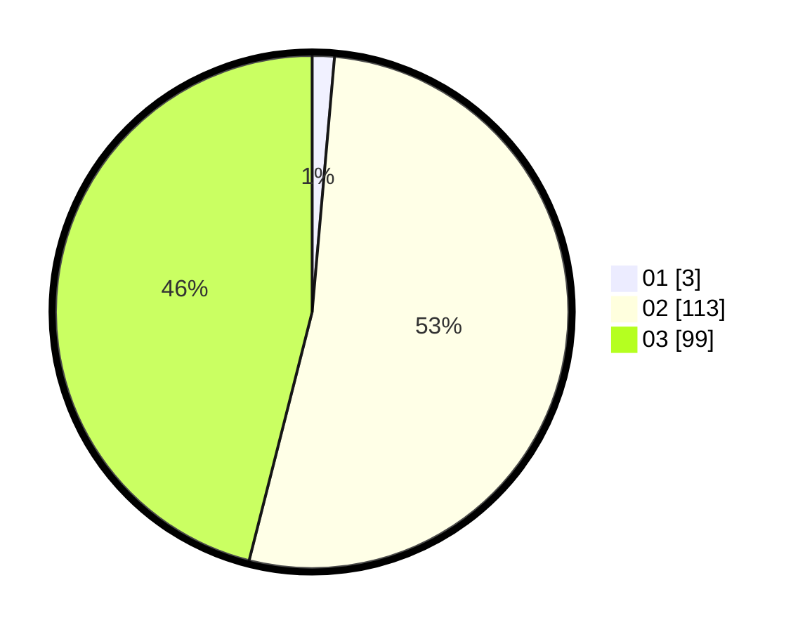

# Hasil

Hasil perolehan suara paslon dapat dilihat pada file paslon-01.txt, paslon-02.txt, dan paslon-03.txt.

Jika tidak ada, artinya data tersebut belum ada pada SIREKAP.

## Perolehan Suara

 * Paslon 01: **3**.
 * Paslon 02: **113**.
 * Paslon 03: **99**.

## Foto C Plano

https://sirekap-obj-formc.kpu.go.id/fa34/pemilu/ppwp/31/73/06/10/04/3173061004181-20240214-191125--3711594c-09a0-45a3-a655-66567ebf5dd8.jpg

https://sirekap-obj-formc.kpu.go.id/fa34/pemilu/ppwp/31/73/06/10/04/3173061004181-20240214-192346--a76c71d8-aa8e-46f8-ac56-bce5a6625a77.jpg

https://sirekap-obj-formc.kpu.go.id/fa34/pemilu/ppwp/31/73/06/10/04/3173061004181-20240214-193557--06e20f87-c0de-4b7d-be79-52517a33d0f9.jpg

## DATA PEMILIH TETAP

Jumlah pemilih dalam DPT: **205**.
 * L: **103**.
 * P: **102**.

## DATA PENGGUNA HAK PILIH

Jumlah pengguna hak pilih dalam DPT: **205**.
 * L: **103**.
 * P: **102**.

Jumlah pengguna hak pilih dalam DPTb: **11**.
 * L: **1**.
 * P: **10**.

Jumlah pengguna hak pilih dalam DPK: **4**.
 * L: **1**.
 * P: **3**.

Jumlah pengguna hak pilih: **220**.
 * L: **105**.
 * P: **115**.

## JUMLAH SUARA SAH DAN TIDAK SAH

JUMLAH SELURUH SUARA SAH: **215**.

JUMLAH SUARA TIDAK SAH: **5**.

JUMLAH SELURUH SUARA SAH DAN SUARA TIDAK SAH: **220**.
