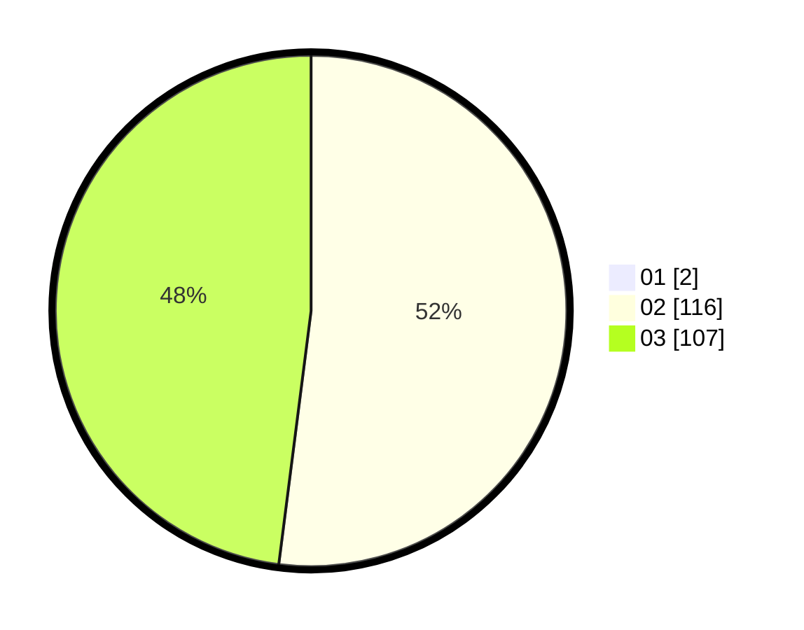

# Hasil

Hasil perolehan suara paslon dapat dilihat pada file paslon-01.txt, paslon-02.txt, dan paslon-03.txt.

Jika tidak ada, artinya data tersebut belum ada pada SIREKAP.

## Perolehan Suara

 * Paslon 01: **2**.
 * Paslon 02: **116**.
 * Paslon 03: **107**.

## Foto C Plano

https://sirekap-obj-formc.kpu.go.id/9ade/pemilu/ppwp/31/73/06/10/04/3173061004187-20240216-015915--8500dba8-ac38-4eff-96cf-8cfdc5d32752.jpg

https://sirekap-obj-formc.kpu.go.id/9ade/pemilu/ppwp/31/73/06/10/04/3173061004187-20240216-015917--bcf84550-10a6-4ad1-a03b-5f8869bef1c6.jpg

https://sirekap-obj-formc.kpu.go.id/9ade/pemilu/ppwp/31/73/06/10/04/3173061004187-20240216-015916--e1d8baa2-b48b-4f62-92eb-7425e0639a0e.jpg

## DATA PEMILIH TETAP

Jumlah pemilih dalam DPT: **293**.
 * L: **141**.
 * P: **152**.

## DATA PENGGUNA HAK PILIH

Jumlah pengguna hak pilih dalam DPT: **231**.
 * L: **114**.
 * P: **117**.

Jumlah pengguna hak pilih dalam DPTb: **1**.
 * L: **1**.
 * P: **0**.

Jumlah pengguna hak pilih dalam DPK: **1**.
 * L: **0**.
 * P: **1**.

Jumlah pengguna hak pilih: **233**.
 * L: **115**.
 * P: **118**.

## JUMLAH SUARA SAH DAN TIDAK SAH

JUMLAH SELURUH SUARA SAH: **225**.

JUMLAH SUARA TIDAK SAH: **8**.

JUMLAH SELURUH SUARA SAH DAN SUARA TIDAK SAH: **233**.
