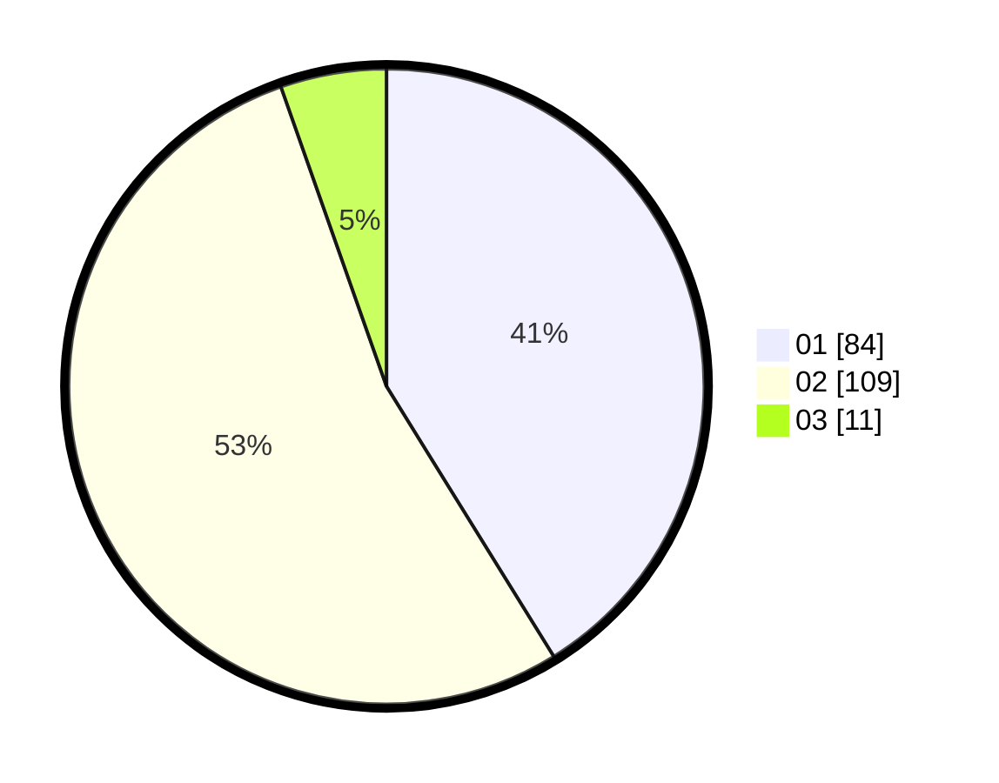

# Hasil

Hasil perolehan suara paslon dapat dilihat pada file paslon-01.txt, paslon-02.txt, dan paslon-03.txt.

Jika tidak ada, artinya data tersebut belum ada pada SIREKAP.

## Perolehan Suara

 * Paslon 01: **84**.
 * Paslon 02: **109**.
 * Paslon 03: **11**.

## Foto C Plano

https://sirekap-obj-formc.kpu.go.id/b807/pemilu/ppwp/31/73/06/10/05/3173061005002-20240214-234159--eab53ddd-b9f1-45c0-8098-9b454165d066.jpg

https://sirekap-obj-formc.kpu.go.id/b807/pemilu/ppwp/31/73/06/10/05/3173061005002-20240214-234436--177e64d7-3d74-4237-ba68-2a044a577017.jpg

https://sirekap-obj-formc.kpu.go.id/b807/pemilu/ppwp/31/73/06/10/05/3173061005002-20240214-234625--d6189194-78b4-42fb-9702-d426c79e8dda.jpg
