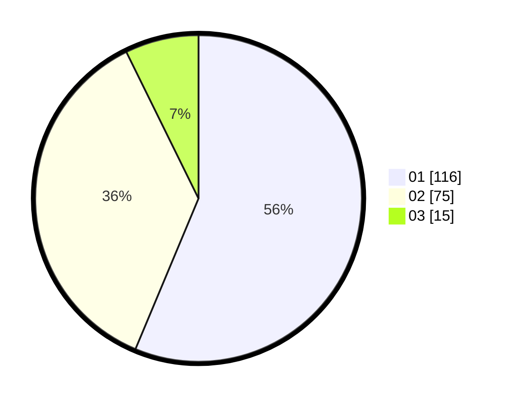

# Hasil

Hasil perolehan suara paslon dapat dilihat pada file paslon-01.txt, paslon-02.txt, dan paslon-03.txt.

Jika tidak ada, artinya data tersebut belum ada pada SIREKAP.

## Perolehan Suara

 * Paslon 01: **116**.
 * Paslon 02: **75**.
 * Paslon 03: **15**.

## Foto C Plano

https://sirekap-obj-formc.kpu.go.id/06a4/pemilu/ppwp/31/73/06/10/05/3173061005003-20240214-214557--31ef9ac9-5fc9-4bca-bae9-8e51bddc9969.jpg

https://sirekap-obj-formc.kpu.go.id/06a4/pemilu/ppwp/31/73/06/10/05/3173061005003-20240214-214653--487b14ad-5f9b-411f-837c-3b688cf1e99b.jpg

https://sirekap-obj-formc.kpu.go.id/06a4/pemilu/ppwp/31/73/06/10/05/3173061005003-20240214-214740--b54bf2bf-6681-460a-b277-25332645e72a.jpg
