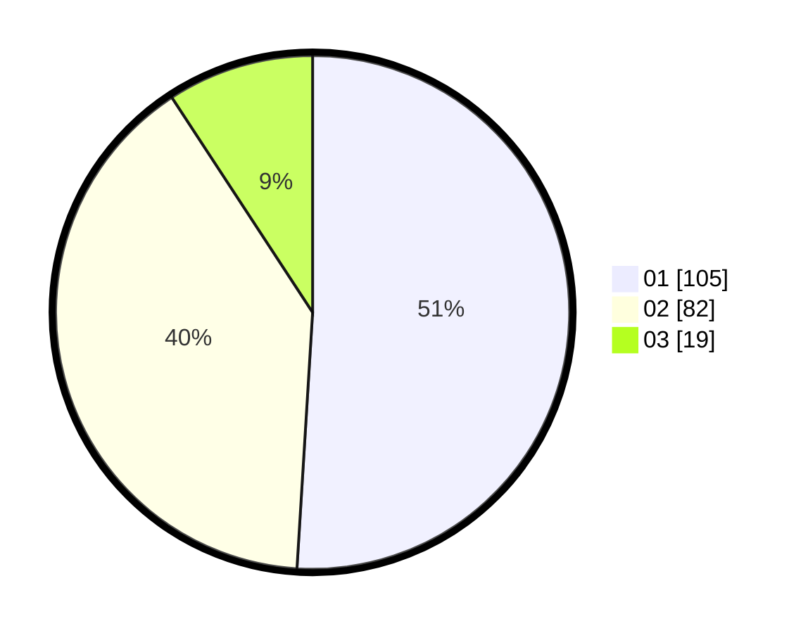

# Hasil

Hasil perolehan suara paslon dapat dilihat pada file paslon-01.txt, paslon-02.txt, dan paslon-03.txt.

Jika tidak ada, artinya data tersebut belum ada pada SIREKAP.

## Perolehan Suara

 * Paslon 01: **105**.
 * Paslon 02: **82**.
 * Paslon 03: **19**.

## Foto C Plano

https://sirekap-obj-formc.kpu.go.id/5d14/pemilu/ppwp/31/73/06/10/05/3173061005007-20240214-221532--bd54ef21-20b0-4537-abf6-6d85e28226a1.jpg

https://sirekap-obj-formc.kpu.go.id/5d14/pemilu/ppwp/31/73/06/10/05/3173061005007-20240214-222053--a80521f8-217d-4d39-94d2-e4d42343e96e.jpg

https://sirekap-obj-formc.kpu.go.id/5d14/pemilu/ppwp/31/73/06/10/05/3173061005007-20240214-221900--d7f97e3c-07da-458e-98eb-a2ec97d8bc30.jpg
